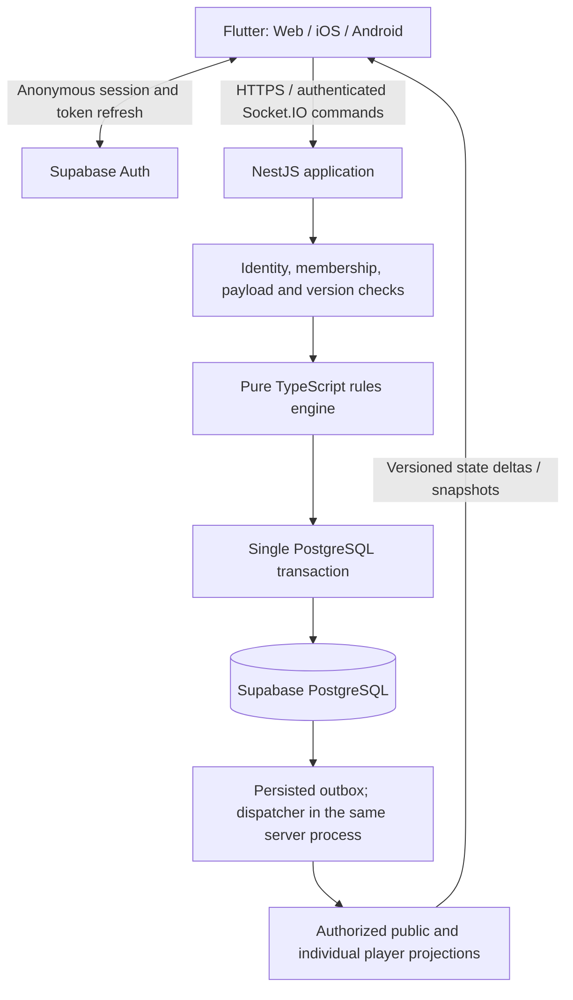

# Private multiplayer board game — technical execution blueprint

Status: **Phases 1–6 implemented with local evidence. Phase 7 in progress: hosted Supabase and both free Render services are live and preflight-clean, and a four-client game has been played through the deployment (P7.2 and P7.4 done, P7.3 partial). Physical devices, separate networks, a complete match, measured ingress and soak measurement remain open (P4.10, P7.3, P7.5–P7.10).**

Prepared: 2026-09-08. Workspace: `/Users/miltos/Downloads/Catan`.

This document specifies the agreed Flutter, NestJS/TypeScript, Supabase and Render implementation. The user authorized implementation through Phase 7 and requested review of Claude’s updated findings before continuing. Work uses one agent and local, free services. See [Phase 4 verification](docs/phase-4-verification.md), [Phase 5 verification](docs/phase-5-verification.md), [Phase 6 verification](docs/phase-6-verification.md), [protocol decisions](docs/protocol.md) and [local setup](README.md). Phase 7 is underway; hosted access is available, while migration-history reconciliation, deployment of the latest fixes and physical-device acceptance remain pending.

## Scope and operating assumptions

| Decision | First release |
| --- | --- |
| Rules | Complete base game for 3–4 human players; target score 10 |
| Audience | Friends joining private rooms with an invitation link or code |
| Capacity | One ongoing room, including a paused game; four seats maximum |
| Play | Live sessions with an optional server-enforced turn timer |
| Identity | Nickname entry backed by an anonymous authenticated identity |
| Clients | Flutter native iOS, native Android, and a mobile-friendly web build |
| Hosting | Supabase Free and Render Free, within their current allowances |
| Presentation | Original name, artwork, sounds, and interface |
| Initial exclusions | Expansions, two-player variants, matchmaking, ranked play, AI opponents, chat/voice, spectators, payments, and offline moves |

The base game supports 3–4 players. The English 2020 base-game rulebook revision `2020_200707` is pinned as `base-2020-v1`; see [rules reference and checksum](packages/game-engine/RULES.md). Consult the [official rulebook index](https://www.catan.com/understand-catan/game-rules); record its revision in the rules package documentation. Use the [base-game FAQ](https://www.catan.com/faq/basegame) for clarifications, taking care to exclude expansion entries. This blueprint uses a combined trade/build action phase and allows development-card play before rolling. Timer, pause, invitation, and recovery policies are application decisions, not additional tabletop rules.

The following defaults were approved for Phase 1: timer Off/60/120/180 seconds; initial placement untimed; 30 seconds for each required discard; pause when a required player disconnects; transfer host controls after a 10-second absence; no identity recovery after local credentials are lost. Exact behavior is specified in Section 3.

### Document map

- **1. Architecture & Schema Design:** trust boundaries, storage, transactions, and wire contracts.
- **2. Project Setup & Scaffolding Checklist:** repository layout, client/server setup, authentication, and infrastructure configuration.
- **3. Phase-by-Phase Implementation Milestones:** seven execution phases, state transitions, and edge-case policies.
- **4. Testing & Deployment Verification Plan:** rule tests, integration scenarios, release procedure, and acceptance gates.

## 1. Architecture & Schema Design

### 1.1 Components and authoritative data flow



The NestJS application owns lobby coordination, commands, random outcomes, deadlines, and persistence. The rules engine consumes validated state, a command, and explicit clock/random inputs, and returns the next state plus typed effects. It does not access sockets, databases, environment variables, or Flutter.

The database is authoritative. In-memory state is a disposable cache. A phone never writes gameplay tables, submits dice results, chooses a stolen resource, or supplies its own authoritative player ID. Supabase Auth provides identity; Socket.IO supplies gameplay updates. Supabase Realtime is not a second gameplay transport in this release.

Run one backend process containing the API, gateway, timer scheduler, and outbox dispatcher. PostgreSQL row locks and durable command receipts provide correctness. Redis, separate workers, and additional game-server instances are deferred until capacity requires them.

### 1.2 State ownership and privacy

| Partition | Contents | Visibility |
| --- | --- | --- |
| Public board | Terrain, numbers, ports, stable vertex/edge IDs, roads, settlements, cities, robber position | Seated room members |
| Public players | Player ID, nickname, colour, seat, resource-card total, unplayed development-card total, played knights, remaining pieces, public points and awards | Seated room members |
| Public session | Phase, turn number, active player, required decision actors, dice, open trades, pause reasons, authoritative deadlines, winner | Seated room members |
| Individual hand | Resource quantities by type; development-card IDs/types and purchase turns; total score including hidden points | Owning player only |
| Individual prompt | Own discard requirement, own legal choices, private consequences of stealing/drawing, command feedback | Owning player only |
| Server state | Exact bank stock, undealt development deck/order, random outcomes used in committed actions, full private event details, runtime ownership | Backend only |
| Authentication | Supabase user ID, access/refresh tokens, credential storage | Identity service and owning client; backend verifies access tokens |

Bank availability is checked on the server and reported when a requested action cannot be fulfilled. Do not stream exact bank inventories as an accidental side channel. Card totals and completed trade terms are public. Other players may infer information from legitimate public play; the application must not disclose additional hidden fields.

Maintain explicit projection functions for public state and each player. Produce deltas by comparing **already authorized projections**, never by diffing the complete secret state and filtering paths afterwards. All serialization is allowlisted. Public logs, errors, analytics, crash reports, hashes exposed to clients, and reconnect responses obey the same privacy boundary.

At game completion, reveal the winner's victory-point cards and final point totals. Other resource hands and the remaining deck remain private. A rematch receives a new room ID and new game state.

### 1.3 Canonical game model

| Model | Required fields or invariants |
| --- | --- |
| Identity and compatibility | `roomId`, `rulesVersion`, `stateSchemaVersion`, `protocolVersion`, monotonically increasing game `version` |
| Board graph | Hex coordinates; integer-lattice vertices; edges as canonical endpoint pairs; adjacency maps; ports attached to coastal vertex pairs |
| Board configuration | Persisted generated layout and fixed topology version; public layout randomness is separate from hidden deck randomness |
| Turn context | `turnNumber`, `activePlayerId`, `phase`, unique `phaseId`, `hasRolled`, `developmentCardPlayedThisTurn` |
| Setup context | Snake-order list, current position, pending settlement vertex, second-settlement resource grant recorded once |
| Required action | Kind, eligible actor IDs, outstanding obligations, continuation phase, bounded progress for multi-step effects |
| Player inventory | Resource counts, identified development cards with `purchasedOnTurn`, remaining physical pieces |
| Awards | Current holder and calculated length/count; public score derived from buildings and awards |
| Trading | Offer ID, proposer, eligible target(s), give/receive bundles, offer revision, originating turn/phase, status |
| Clock context | Timer mode, remaining budget, deadline, clock generation, per-player discard deadlines, pause reasons and suspended values |
| End state | Winner or abandonment reason, final totals, ended timestamp; no further gameplay mutations |

Use integer resource quantities and stable IDs everywhere. Screen coordinates never identify a legal move. Store the generated board so rendering or generation changes cannot alter an ongoing match. Recompute derived values through the engine and verify them against invariants before committing.

Base inventory fixtures cover 19 hexes, 54 vertices, 72 edges, 9 ports, 19 cards per resource, and 25 development cards. Each player has 15 roads, 5 settlements, and 4 cities. The development deck contains 14 knights, 5 victory points, and two each of Road Building, Monopoly, and Year of Plenty. Validate counts against the pinned rulebook before implementation. The [official base-game rules and inventory](https://www.catan.com/sites/default/files/2021-07/catan-25th-rules_eng-200313.pdf) provide the reference; extension and helper components are excluded.

### 1.4 Database layout and access model

Create application tables in an `app` PostgreSQL schema that is **not exposed through the Supabase Data API**. Mobile/web clients use Supabase only for authentication. All room and game reads/writes pass through NestJS.

Use separate migration-owner and runtime database roles. The runtime role has only the table privileges needed below; it cannot create schemas or change policies. Enable RLS as defense in depth: deny `anon` and `authenticated` access, and grant explicit policies to the backend runtime role. Backend membership checks remain mandatory because a backend role can access multiple players' data. A publishable key is not a server credential. See [Supabase RLS](https://supabase.com/docs/guides/database/postgres/row-level-security).

Unless stated otherwise, identifiers are UUIDs, timestamps are UTC `timestamptz`, versions are nonnegative PostgreSQL `integer` values, and counts cannot be negative. Nullable columns are explicitly marked. JSONB content is checked by versioned runtime schemas and database object/type constraints.

#### 1.4.1 `app.rooms`

One room represents one lobby and its single match. Keep completed records for results; create another room for a rematch.

| Column | Type / constraints | Purpose |
| --- | --- | --- |
| `id` | UUID primary key | Stable room identity |
| `host_player_id` | UUID, initially nullable | Current host's membership ID |
| `created_by_user_id` | UUID FK `auth.users`, restrict deletion | Creator identity for initial authorization |
| `status` | Text enum `LOBBY`, `ACTIVE`, `PAUSED`, `FINISHED`, `ABANDONED`, `EXPIRED` | Room lifecycle |
| `revision` | Integer, default 0 | Version of room metadata and membership |
| `active_slot` | Smallint nullable; either 1 or null; unique when non-null | Enforces one ongoing room atomically |
| `settings` | JSONB object | `maxPlayers:4`, `turnLimitSeconds` null/60/120/180, `boardMode:STANDARD_RANDOM`, fixed rules version |
| `invitation_hash` | Text unique | Hash of a random join code; never expose in room snapshots |
| `invitation_expires_at` | Timestamp nullable | Expiry for joining a lobby; does not revoke a seated player's identity |
| `runtime_epoch` | UUID nullable | Fences writes from a replaced backend process |
| `runtime_heartbeat_at` | Timestamp nullable | Recovery checkpoint for stopped clocks; operational metadata |
| `created_at`, `updated_at` | Timestamps | Audit timestamps |
| `started_at`, `ended_at` | Timestamps nullable | Match lifecycle |

Constraints: `active_slot=1` for `LOBBY`, `ACTIVE`, or `PAUSED`; null for terminal states. `host_player_id` must reference a player in the same room using a composite foreign key. Creation inserts the room and host membership in one transaction and sets the host before commit. Use a deferred consistency constraint for that creation cycle. Index status/update time for cleanup and restoration.

Generate a 10-character random Crockford Base32 invitation code, normalize case/separators on entry, and store only its hash on the room row. The privileged creation receipt retains the host's original response, including that code, to support idempotent retries; protect that receipt as secret data. The code gives admission to an unstarted lobby; it cannot recover another player's seat or join a running game as a new player. The host receives the plaintext at creation and can rotate it if lost. Invitation attempts are rate limited. An idle lobby expires after 24 hours; active/paused games do not silently expire. Evaluate lobby expiry on boot and create/join/subscribe requests so a sleeping server cannot leave an expired lobby occupying the active slot. Operational heartbeats do not extend lobby activity time.

#### 1.4.2 `app.players`

This table represents **room membership**, not a second user-authentication system. Resource hands are not duplicated here.

| Column | Type / constraints | Purpose |
| --- | --- | --- |
| `id` | UUID primary key | Public player ID |
| `room_id` | UUID FK `rooms`, restrict deletion | Membership scope |
| `auth_user_id` | UUID FK `auth.users`, restrict deletion | Verified owner, never sent to opponents |
| `nickname` | Text, validated length | Display name; 2–20 grapheme clusters |
| `nickname_key` | Text | Server-normalized comparison key |
| `seat_index` | Smallint nullable, range 0–3 | Lobby seat; fixed after start |
| `colour` | Text nullable, allowed palette enum | Distinct piece colour |
| `ready` | Boolean default false | Lobby readiness |
| `joined_at` | Timestamp | Membership creation |
| `left_at` | Timestamp nullable | Voluntary departure before game start |
| `last_seen_at` | Timestamp nullable | Coarse operational record; not proof of live connectivity |

Unique constraints: `(room_id, auth_user_id)` and `(room_id, id)`. Partial unique indexes on `(room_id, seat_index)`, `(room_id, colour)`, and `(room_id, nickname_key)` for memberships whose `left_at` is null. A pre-game rejoin restores the existing row and checks available seat/colour. Once a game starts, membership rows and seat ownership are immutable; disconnecting does not set `left_at`.

Normalize names on the server, reject control characters, and render names as text. Actual presence is maintained by authenticated live sockets, not trusted `last_seen_at` values. Host transfer changes `rooms.host_player_id`, not player identity.

#### 1.4.3 `app.game_states`

One authoritative current snapshot per room. Create it when the host starts the match.

| Column | Type / constraints | Purpose |
| --- | --- | --- |
| `room_id` | UUID primary key / FK `rooms` | One match per room |
| `version` | Integer, default 0 | Successful state-transition sequence |
| `rules_version` | Text | Pinned engine/rules behavior |
| `schema_version` | Integer positive | Stored-state compatibility |
| `phase` | Text enum from Section 3 | Indexed current phase |
| `phase_id` | UUID | Identifies the current decision context |
| `turn_number` | Integer nonnegative | 0 during initial setup |
| `active_player_id` | UUID, same-room membership FK | Current setup or turn owner |
| `public_state` | JSONB object | Shared board, public players, session and trades |
| `private_state` | JSONB keyed by player ID | Individual hands, hidden points, private prompts |
| `server_state` | JSONB object | Bank, undealt deck, required-effect internals |
| `clock_state` | JSONB object | Running/frozen turn and decision clocks |
| `next_deadline_at` | Timestamp nullable, indexed | Earliest running clock; derived from `clock_state` |
| `updated_at` | Timestamp | Last committed game change |

Scalar phase/turn/deadline fields are query indexes of the canonical model, updated in the same transaction as JSONB. They are never edited independently. A paused room retains its gameplay phase, with deadlines suspended. Avoid a second independently writable source of resource or score data.

#### 1.4.4 `app.move_logs`

Append-only committed game transitions. This is an internal audit/replay record; clients receive a separate sanitized activity projection.

| Column | Type / constraints | Purpose |
| --- | --- | --- |
| `id` | UUID primary key | Internal event identity |
| `room_id` | UUID FK `game_states` | Match identity |
| `sequence` | Integer; unique `(room_id, sequence)` | Resulting game version |
| `command_id` | UUID | Original user or deterministic system command |
| `actor_player_id` | UUID nullable, same-room FK | Null for a system transition |
| `actor_kind` | `PLAYER` or `SYSTEM` | Distinguishes timeout/recovery operations |
| `command_type` | Text | Validated command kind |
| `validated_payload` | JSONB | Full internal input, potentially private |
| `effects` | JSONB | Typed effects, including recorded random outcomes |
| `public_activity` | JSONB | Allowlisted public activity items |
| `rules_version` | Text | Replay behavior |
| `created_at` | Timestamp | Commit processing time |

Game creation records sequence 0 with the initial canonical snapshot in its internal effects, including the private shuffled deck. Later commands append one transition per resulting version. Runtime permission is SELECT/INSERT only; no ordinary UPDATE/DELETE. Public history never returns raw `validated_payload` or `effects`. An operator can export internal history for recovery, and must treat it as private.

#### 1.4.5 Supporting tables required for reliability

| Table | Columns and constraints | Function |
| --- | --- | --- |
| `app.command_receipts` | `actor_key`, `command_id` composite PK; nullable `room_id` FK to rooms with `ON DELETE SET NULL`; canonical `request_hash`; final `status` (`ACCEPTED`/`REJECTED`); nullable actor-only `response` JSONB; `created_at` | Idempotency for room creation/joining and gameplay; actor key is derived from verified user identity or a server-only system namespace; creation responses may contain the host's invitation |
| `app.outbox_events` | UUID PK; `room_id`; `scope` (`ROOM`/`GAME`); `from_version`; `to_version`; `public_payload` JSONB; `private_payloads` JSONB keyed by player ID; `attempts`; nullable `published_at`; `created_at`; unique `(room_id, scope, to_version)` | Durable post-commit notification; room payloads may contain complete room snapshots, game payloads contain deltas |
| `app.runtime_control` | Singleton primary key `id=1`; nullable `active_epoch` UUID before first boot; `claimed_at` timestamp nullable | Fences the one backend process, including room creation during deployment overlap; seeded by migration and never exposed to clients |

An outbox row is committed with every durable room/game revision. Initial room/game snapshots use `from_version=null`, `to_version=0`. A start command can create both a room revision event and a game version-0 event. Index unpublished outbox rows by room/scope/version. A runtime publisher may update only delivery metadata, never stored payloads.

Retain game state, receipts, move history, and outbox data throughout an ongoing game. Initially retain completed game records for 30 days, then run an explicit maintenance/export procedure. Preserve compact receipt tombstones (actor, command ID, hash and status) when purging a terminal room; clear the response body and room FK as needed. A retry of such a command returns `RECEIPT_EXPIRED` and never executes the old intent again. This avoids resurrecting an old room-creation command after cleanup. Do not delete anonymous Auth users referenced by retained memberships. Automatic Auth-user cleanup must not run against active players. The small first release does not need a cloud cron service.

### 1.5 Transaction and duplicate-command algorithm

Use the Node PostgreSQL driver with one checked-out connection per transaction. Do not assemble a transaction from independent Supabase REST requests. For Render connectivity, use the Supabase session pooler where IPv4 is required, with verified TLS and a small connection pool. The connection choices are documented in [Supabase's PostgreSQL connection guide](https://supabase.com/docs/guides/database/connecting-to-postgres).

1. Validate token, payload size/schema, rate limit, and actor identity before opening a database transaction.
2. Hold a shared row lock on `runtime_control` and verify the process epoch. Next acquire a transaction-scoped advisory lock derived from `(actor_key, command_id)`, then look up `command_receipts`. A concurrent duplicate waits for the original transaction. A matching completed receipt returns its saved response; the same ID with a different request hash is rejected. No placeholder receipt row is needed; transaction rollback releases the reservation lock.
3. Lock the `rooms` row, then the `game_states` row if applicable. Global lock order is runtime-control shared lock → command advisory lock → room row → game row. Creation also relies on the unique active-slot constraint. Read all state needed for validation on this same connection.
4. Verify the backend runtime epoch, membership/host permission, room status, expected version, expected phase, and server-clock deadline. A duplicate receipt is checked **before** version rejection.
5. Apply one engine command to the locked current state. Validate stock, piece, score, trade, and phase invariants. Generate randomness on the server and record the selected outcomes.
6. Persist next state, increment relevant versions, insert the move log and outbox event, and finalize the receipt in the same transaction. A rule rejection commits only its sanitized rejection receipt, not game changes.
7. Commit, then acknowledge success. Broadcast only committed projections. A transport acknowledgement never substitutes for the commit.
8. On database/serialization/deadlock failure, roll back everything and retry only a bounded number of times or return a retryable infrastructure error. Never return success for an uncertain commit; retry the same command ID to discover its receipt.

PostgreSQL row locks serialize competing moves for the same game; see [explicit locking](https://www.postgresql.org/docs/current/explicit-locking.html). Two acceptances of one trade cannot both spend its resources. Timeouts use deterministic command IDs derived from room, phase, clock generation, and deadline, and follow the same transaction path. An internal timeout validates that decision's phase/generation/deadline against the locked current state instead of requiring a previously observed global version; another player's discard must not permanently invalidate its stable timeout ID. Internal system commands are never accepted from client payloads.

The scheduler and a player action may race. Under the room lock, if database time is already at or beyond the applicable deadline, reject the player action as expired and let the scheduler commit the timeout. A timer referencing an old phase/generation is a no-op. A timer that wakes early returns a retryable not-due outcome **without storing a final receipt**, so its stable ID can still execute when the deadline arrives. The scheduler must not start a second nested transaction from within a player transaction.

### 1.6 Outbox delivery and reconnect consistency

- The in-process dispatcher drains committed outbox rows in version order for each room and scope.
- A game update combines public changes and that recipient's private changes in one logical message. There is no room-wide broadcast of all private payloads.
- Mark an event published after attempting delivery. That marker is not proof that every phone received it; retry after a publisher crash may produce duplicates.
- Every connected client receives version progress, including an empty personal delta when appropriate. Duplicate versions are ignored; gaps trigger resynchronization.
- A fresh/reconnected subscriber is authorized before joining server-assigned channels. Queue live updates while reading a consistent snapshot; install the snapshot, then apply only queued updates newer than its version.
- On reconnect, return a current snapshot in v1. There is no need to replay the entire private history over the network. Restore public activity separately with membership checks and bounded pagination.
- Send a lightweight `game.version` check every 15 seconds while a game is open, and on app foregrounding. This detects a missed final update even if no later move occurs. Do not write every heartbeat to the game log.

Socket.IO supplies ordering on a connection but defaults to at-most-once arrival. Persistent receipts, versions, snapshots, and the outbox provide application-level recovery; do not claim exactly-once network delivery. See [Socket.IO delivery guarantees](https://socket.io/docs/v4/delivery-guarantees/).

### 1.7 WebSocket protocol

Use Socket.IO namespace `/game`, transport path `/socket.io`, and WebSocket transport on both clients and server. Use HTTPS/WSS outside local development. The endpoint is a Socket.IO endpoint, not a plain-WebSocket endpoint. NestJS supports this through its Socket.IO adapter; multi-instance routing would require revisiting the adapter and connection routing. See [NestJS adapters](https://docs.nestjs.com/websockets/adapter).

The Flutter client uses a pinned compatible `socket_io_client` release. Its documented compatibility maps Dart client 3.x to Socket.IO server 4.7+ within 4.x; verify the exact installed pair with Web, iOS, and Android handshake tests before accepting the scaffold. See the [package's compatibility table](https://pub.dev/packages/socket_io_client).

#### Connection and common envelope

Handshake authentication fields: `accessToken`, `protocolVersion:1`, and a non-authoritative `clientInstanceId`. Tokens must not appear in URL query parameters. The server verifies signature, algorithm, issuer, audience, expiry, and subject, then derives the actor from the token. The client cannot select another subject or subscribe to an arbitrary Socket.IO room.

All mutating room/game commands carry these fields:

| Field | Type | Contract |
| --- | --- | --- |
| `protocolVersion` | Integer | Must be supported; initial version 1 |
| `commandId` | UUID string | New for a new intent; unchanged for transport retries |
| `roomId` | UUID or null | Null only for create/join; joining uses a code in the payload |
| `expectedVersion` | Integer or null | Room revision for room commands, game version for game commands; null only for initial create/join |
| `expectedPhaseId` | UUID or null | Required for gameplay; null for lobby/session commands |
| `type` | Enumerated string | Discriminates the payload schema |
| `payload` | Object | Only fields allowed for that type |

Request hashing covers the canonical complete intent, including expected version/phase and target room, but excludes the refreshed access token. A changed payload or expected version requires a new command ID. Set a 16 KiB incoming command limit, bounded arrays/strings, integer bundle limits, and reject unknown command fields. Provision a larger, bounded outbound snapshot limit based on measured board data; initial target 128 KiB.

Only one unacknowledged mutating command per client is sent at a time. Network retries retain the ID and payload. `STALE_VERSION` or `WRONG_PHASE` refreshes the view and requires a new user decision for strategic actions; never automatically replay a stale build or trade against changed state. Mandatory discards can be reconfirmed after refresh if the same obligation remains.

#### Client → server event catalogue

| Event | Command type / payload | Authorization and behavior |
| --- | --- | --- |
| `room.command` | `CREATE_ROOM`: `{nickname, settings}` | Authenticated guest; creates host membership and returns code |
| `room.command` | `JOIN_ROOM`: `{nickname, invitationCode}` | Admit to lobby or return own existing membership; never claim by nickname |
| `room.command` | `SET_PROFILE`: `{nickname, colour}` | Own membership in lobby; rejects collisions |
| `room.command` | `SET_READY`: `{ready}` | Own membership in lobby |
| `room.command` | `UPDATE_SETTINGS`: `{turnLimitSeconds, boardMode}` | Host in lobby; resets everyone's ready status |
| `room.command` | `ROTATE_INVITATION`: `{}` | Host in lobby; returns new code only to host |
| `room.command` | `LEAVE_LOBBY`: `{}` | Own membership before start; releases seat and transfers host if needed |
| `room.command` | `START_GAME`: `{}` | Host; 3–4 seated, ready, connected players with distinct colours |
| `room.command` | `CREATE_REMATCH`: `{}` | Host of finished/abandoned room; creates new lobby, invitation and host membership; others explicitly rejoin |
| `game.command` | `PLACE_SETUP_SETTLEMENT`: `{vertexId}` | Current setup actor; legal distance and unoccupied vertex |
| `game.command` | `PLACE_SETUP_ROAD`: `{edgeId}` | Current setup actor; adjacent to the just-placed settlement |
| `game.command` | `ROLL_DICE`: `{}` | Active player in `AWAIT_ROLL`; server generates both dice |
| `game.command` | `DISCARD_RESOURCES`: `{resources}` | Player with an outstanding discard; exact count and owned quantities |
| `game.command` | `MOVE_ROBBER`: `{hexId}` | Active player in `ROBBER_MOVE`; target differs from current hex |
| `game.command` | `CHOOSE_ROBBER_VICTIM`: `{victimPlayerId}` | Eligible adjacent opponent; server chooses the stolen card |
| `game.command` | `BUILD_ROAD`: `{edgeId}` | Active player in `ACTION`; graph and cost checks |
| `game.command` | `BUILD_SETTLEMENT`: `{vertexId}` | Active player in `ACTION`; connectivity, distance and cost checks |
| `game.command` | `BUILD_CITY`: `{vertexId}` | Upgrade own settlement; piece and cost checks |
| `game.command` | `BANK_TRADE`: `{giveType, receiveType, receiveCount}` | Server derives owned-port rate and payment; different resource types |
| `game.command` | `PROPOSE_TRADE`: `{targetPlayerId:null-or-id, give, receive}` | Active proposer may target anyone/all; another player may target only the active player |
| `game.command` | `ACCEPT_TRADE`: `{offerId, offerRevision}` | Eligible counterparty; atomic revalidation and settlement |
| `game.command` | `DECLINE_TRADE`: `{offerId, offerRevision}` | Eligible counterparty; records own response |
| `game.command` | `CANCEL_TRADE`: `{offerId, offerRevision}` | Proposer cancels an open offer |
| `game.command` | `BUY_DEVELOPMENT_CARD`: `{}` | Active player in `ACTION`; server draws next hidden card |
| `game.command` | `PLAY_DEVELOPMENT_CARD`: `{cardId, choice}` | Own eligible card in `AWAIT_ROLL` or `ACTION`; `choice` is validated by card type |
| `game.command` | `PLACE_FREE_ROAD`: `{edgeId}` | Active player resolving Road Building; no resource payment |
| `game.command` | `FINISH_FREE_ROADS`: `{}` | Ends remaining free roads only as permitted by the pinned rule revision; cannot undo an already placed road |
| `game.command` | `END_TURN`: `{}` | Active player in `ACTION`; no outstanding required effect |
| `game.command` | `PAUSE_GAME`: `{}` | Host; records manual pause without changing gameplay phase |
| `game.command` | `RESUME_GAME`: `{}` | Host; required actors connected and recovery checks passed |
| `game.command` | `ABANDON_GAME`: `{}` | Host; terminal state with no winner, explicit confirmation in UI |
| `session.subscribe` | `{requestId, roomId, lastRoomRevision, lastGameVersion}` | Read request; authorize membership, then return room/game snapshots |
| `game.sync` | `{requestId, roomId, lastGameVersion}` | Read request; return current authorized snapshot |
| `game.version.request` | `{roomId}` | Read request on foreground or periodic check |
| `auth.refresh` | `{accessToken}` | Verify refreshed token with same subject and revalidate subscriptions |

Resource bundles use exactly `brick`, `lumber`, `wool`, `grain`, and `ore` with nonnegative integers. `PLAY_DEVELOPMENT_CARD.choice` is an empty object for Knight/Road Building, `{resourceType}` for Monopoly, or `{resources}` for Year of Plenty. Those resource choices are submitted atomically with card play, so a disconnect cannot consume the card before those choices exist. Victory-point cards have no play command; victory is detected by the server.

`CREATE_REMATCH` is idempotent under its original command ID and may proceed only when the single active slot is free. Original participants are not silently added to a new game. They enter the new invitation and ready up.

#### Server → client event catalogue

| Event | Payload fields | Notes |
| --- | --- | --- |
| `server.hello` | `protocolVersion`, `serverTime`, `heartbeatIntervalMs`, `maxCommandBytes` | Sent after successful authentication |
| Socket.IO acknowledgement | `commandId`, `status`, `scope`, `roomId`, `version`, optional sanitized `result` or `error`, `serverTime` | Durable success/rejection response; result can include a newly created invitation only for its host |
| `room.snapshot` | `roomId`, `revision`, `hostPlayerId`, `status`, `settings`, public membership list | Complete room view; no invitation hash or Auth IDs |
| `game.snapshot` | `roomId`, `version`, `rulesVersion`, `stateSchemaVersion`, `publicState`, `privateState`, `serverTime` | `privateState` contains only the recipient's view |
| `game.delta` | `roomId`, `fromVersion`, `toVersion`, `publicPatch`, `privatePatch`, `activity`, `serverTime` | One recipient-specific update per committed game version |
| `game.version` | `roomId`, `version`, `roomRevision`, `serverTime` | Cheap consistency/clock check; no private data |
| `presence.update` | `roomId`, `onlinePlayerIds`, `observedAt` | Ephemeral presence; does not increment game version |
| `session.error` | Stable error `code`, safe `message`, `retryable`, optional `requestId` | Read/transport failures; never database internals |
| `server.restarting` | `retryAfterMs` | Advisory only; recovery cannot depend on receiving it |

Patch format is a restricted JSON Patch subset (`add`, `replace`, `remove`) over explicitly permitted public/private paths. Entity collections use ID-keyed maps, avoiding unstable array indices. A patch is constructed from the previous and next projection for the same player. Validate and apply public/private patches atomically to an immutable Flutter view model.

Examples below illustrate a single accepted road purchase. IDs and numbers are synthetic. The private patch is specific to the player who built it; another player receives a different private patch.

Client emits `game.command`:

```json
{
  "protocolVersion": 1,
  "commandId": "bba03ee0-0e90-49ab-9bea-f53dd7e07eed",
  "roomId": "f2eae93d-47da-4b0a-b2df-3b51d8bc4d13",
  "expectedVersion": 41,
  "expectedPhaseId": "a58d743c-31a1-49fa-8b02-31a2a9b0af42",
  "type": "BUILD_ROAD",
  "payload": {"edgeId": "e-17"}
}
```

Server acknowledges after committing:

```json
{
  "commandId": "bba03ee0-0e90-49ab-9bea-f53dd7e07eed",
  "status": "ACCEPTED",
  "scope": "GAME",
  "roomId": "f2eae93d-47da-4b0a-b2df-3b51d8bc4d13",
  "version": 42,
  "serverTime": "2026-09-08T18:30:00.000Z"
}
```

Illustrative fields in the resulting `game.delta` (the real patch includes **all** changed projection fields, including pieces and any awards):

```json
{
  "roomId": "f2eae93d-47da-4b0a-b2df-3b51d8bc4d13",
  "fromVersion": 41,
  "toVersion": 42,
  "publicPatch": [
    {"op": "add", "path": "/roads/e-17", "value": {"ownerPlayerId": "752dd84d-b7e3-4723-b412-77c12ad13f69"}},
    {"op": "replace", "path": "/players/752dd84d-b7e3-4723-b412-77c12ad13f69/resourceCardCount", "value": 4}
  ],
  "privatePatch": [
    {"op": "replace", "path": "/resources/brick", "value": 1},
    {"op": "replace", "path": "/resources/lumber", "value": 0}
  ],
  "activity": [{"type": "ROAD_BUILT", "actorPlayerId": "752dd84d-b7e3-4723-b412-77c12ad13f69", "edgeId": "e-17"}],
  "serverTime": "2026-09-08T18:30:00.000Z"
}
```

Acknowledgements and deltas may arrive in either order. An acknowledgement resolves pending intent but does not advance the displayed state version. A snapshot or correctly based delta advances the view. If `fromVersion` differs from the installed version, request a snapshot; do not partially apply the patch.

Errors include `UNAUTHENTICATED`, `TOKEN_EXPIRED`, `FORBIDDEN`, `ROOM_UNAVAILABLE`, `ROOM_FULL`, `NAME_TAKEN`, `GAME_ALREADY_STARTED`, `STALE_VERSION`, `WRONG_PHASE`, `NOT_YOUR_TURN`, `ILLEGAL_PLACEMENT`, `INSUFFICIENT_RESOURCES`, `BANK_UNAVAILABLE`, `CARD_NOT_PLAYABLE`, `TRADE_UNAVAILABLE`, `DEADLINE_EXCEEDED`, `GAME_PAUSED`, `GAME_FINISHED`, `COMMAND_ID_REUSED`, `RECEIPT_EXPIRED`, `RATE_LIMITED`, `PROTOCOL_UNSUPPORTED`, and `SERVICE_UNAVAILABLE`. Opponent-sensitive errors reveal only that an action is unavailable, not their hand quantities.

### 1.8 Minimal HTTP surface

- `GET /health/live`: process liveness, no database contents or secrets.
- `GET /health/ready`: database reachability and compatible schema; short timeout, meaningful unavailable response.
- `GET /api/v1/rooms/{roomId}/activity`: authenticated, membership-checked, bounded sanitized history with cursor pagination.
- `GET /api/v1/version`: public supported protocol/build information; no infrastructure secrets.

Gameplay mutations have one gateway/service path. If an HTTP mutation interface is added later, it must reuse the identical command service and receipts. No public room enumeration endpoint is planned.

## 2. Project Setup & Scaffolding Checklist

### 2.1 Planned monorepo layout

The following layout defines package ownership. Phase 1 creates the foundational packages and native targets; later feature modules are deferred.

| Path | Responsibility |
| --- | --- |
| `apps/mobile/` | Flutter project with `lib/`, `test/`, `integration_test/`, `web/`, `ios/`, and `android/` |
| `apps/mobile/lib/core/` | Configuration, networking, guest session, error mapping, shared UI |
| `apps/mobile/lib/features/` | Entry, lobby, board/game, trading, results and recovery presentation |
| `apps/server/` | NestJS app: Auth, Rooms, GameCommands, Gateway, Persistence, Timers and Outbox modules |
| `packages/game-engine/` | Pure TypeScript graph, rules, state transitions, projections and deterministic fixtures |
| `packages/protocol/` | Versioned JSON schemas and synthetic contract fixtures consumed by both languages |
| `supabase/migrations/` | Ordered SQL schema, roles, constraints and policies |
| `docs/` | Rule revision, API protocol, local setup, deployment and recovery instructions |
| `scripts/` | Future reproducible build/verification helpers |
| `render.yaml` | Future Render service definitions; secret names only |
| `PLAN.md` | This execution/review document |

Use npm workspaces for TypeScript packages and Flutter's own package tooling for Dart. Share **wire schemas and fixtures**, not assumed cross-language source types. Generate Dart models only after choosing and validating a schema tool; manually modeled DTOs plus cross-language fixtures are acceptable for v1. Riverpod manages guest session, room snapshot, game snapshot, pending command, and connectivity separately. Providers select narrow view slices so a countdown does not repaint the whole board.

### 2.2 Toolchain and backend checklist

- [x] After plan review, inspect installed Flutter/Dart, Xcode, Android SDK/JDK, Node, npm, Docker and Supabase CLI versions.
- [x] Select supported stable Flutter and Node LTS versions, then pin exact versions and lockfiles. Do not upgrade SDKs unrelated to a concrete compatibility need.
- [x] Initialize repository metadata only during approved scaffolding; preserve this plan.
- [ ] Initialize NestJS with TypeScript strictness, build/lint configuration, and engine/protocol package boundaries.
- [x] Add NestJS Socket.IO integration, PostgreSQL driver, a maintained JWT verification library, and runtime schema validation.
- [x] Bind HTTP and Socket.IO to `0.0.0.0` and Render's assigned `PORT`; use one port and graceful shutdown hooks.
- [x] Configure `/game`, `/socket.io`, WebSocket-only transport, explicit browser origin allowlist, command limits, and connection/request throttling. Native clients may have no browser Origin; token validation is always required.
- [x] Keep Engine.IO heartbeat settings explicit, initially 25-second ping interval and 20-second timeout; verify actual mobile suspend behavior.
- [x] Provide liveness/readiness endpoints, build/protocol identification, redacted logs, and boot-time schema/rules compatibility checks.
- [x] Use one checked-out database client for each transaction, a small pool (initial maximum 5), and bounded acquisition/statement timeouts.
- [x] Draft a production Docker image with a pinned Node base, dependency/build stages, and a non-root runtime user. Persist no game data inside the container.

### 2.3 Flutter checklist

- [x] Create iOS, Android and web targets from one Flutter project; choose an original working app name and package identifiers.
- [ ] Add Riverpod, routing, Supabase Flutter, compatible Socket.IO client, and platform-appropriate session storage.
- [ ] Define immutable view models and explicit loading, reconnecting, paused, pending-command, and error states.
- [ ] Separate client-side placement highlighting from server rule enforcement; server approval remains necessary.
- [ ] Create configuration flavors for local development and hosted play, using public build-time configuration only.
- [ ] Plan nickname → invitation/lobby → game → results routes; preserve the invitation across first-time authentication.
- [ ] Use the canonical web invitation URL with a fragment route such as `/#/join/CODE`; it can be shared and opened in a browser immediately. Native v1 also accepts pasted codes/links. Universal/App Links are optional later work, not a free-launch dependency.
- [ ] Prepare native iOS signing and Android internet/release configuration, without creating store listings.
- [ ] Plan pinch zoom/pan, touch target sizes, text scaling, colour-independent piece identification, and board semantics for accessibility.

### 2.4 Supabase and anonymous identity checklist

- [ ] Create/select a Free Supabase project near the game server region; use local Supabase for development and destructive tests.
- [ ] Enable anonymous sign-ins. Restore an existing session on launch; create a new anonymous user only when no valid session can be recovered.
- [ ] On nickname submission, send the nickname to the backend with the authenticated session. Store membership ownership using the verified token subject.
- [x] Configure JWT verification using the project's supported signing keys/JWKS, expected issuer/audience, allowed algorithms and bounded clock skew. Fail closed if an unrecognized key cannot be verified.
- [x] Verify access tokens at connection, refresh and command time. On expiry, stop mutations until refresh; a changed subject requires a new connection and new membership authorization.
- [x] Persist native credentials through a reviewed secure-storage integration. On web, use the SDK session persistence with appropriate origin/script restrictions. Do not write private game snapshots to durable browser caches.
- [x] Apply migrations using the migration role; connect NestJS using its restricted runtime database credential. No service-role or database password enters Flutter assets or build definitions.
- [ ] Limit anonymous Auth and room/code attempts. Start with conservative per-IP/per-user limits that allow four players behind one NAT; apply project-side bot protection if the endpoint becomes abused. Nickname entry remains the normal flow.
- [x] Verify clients with publishable credentials cannot read or mutate `app` tables, even when authenticated anonymously.
- [x] Document loss-of-credentials behavior: a new anonymous identity cannot recover another seat using its nickname or the invitation. The group can abandon and restart if recovery credentials are gone.

Supabase anonymous users are authenticated users with an `is_anonymous` claim; they are distinct from unauthenticated requests using a publishable key. They cannot recover the identity on another device without a linking mechanism, which is outside this release. See [anonymous sign-ins](https://supabase.com/docs/guides/auth/auth-anonymous) and [JWT verification](https://supabase.com/docs/guides/auth/jwts).

### 2.5 Configuration ownership

| Configuration | Location / exposure |
| --- | --- |
| API base URL, web base URL, Supabase project URL and publishable key | Public Flutter build configuration |
| Database runtime connection string | Render server secret |
| Migration connection string | Local/operator or protected release secret; excluded from server runtime |
| JWT issuer/JWKS URL, supported protocol/rules versions | Server configuration; values may be public but are not client-controlled |
| Allowed web origins, payload/rate limits, log level | Server environment |
| `PORT`, production runtime mode | Render environment |
| Android signing key / iOS signing credentials | Local secure storage or protected release secrets |

Use ignored local environment files and a future example file containing names/placeholders only. Never repurpose system environment variables for task-specific values. Keep paid upgrades disabled; verify provider behavior when free allowances are exhausted before deployment.

## 3. Phase-by-Phase Implementation Milestones

Phases are ordered dependencies. Each exit gate must pass before the next phase is considered complete. Persistence and authorization are introduced with the first lobby; Phase 5 completes gameplay delivery and failure recovery rather than retrofitting trust after an unprotected prototype.

### Phase 1 — Establish the project and game protocol

Dependencies: user review of this blueprint; local toolchain access. **Satisfied.**

Completed 2026-09-09. Evidence: [verification record](docs/phase-1-verification.md). There are 115 shared contract fixtures; Web, iOS simulator and Android emulator authentication checks pass. Hosted deployment and physical-device signing remain untested.

- [x] P1.1 Resolve the review decisions at the end of this document and pin the base-rule revision and protocol version.
- [x] P1.2 Inventory the installed SDKs; create the planned workspace and lock compatible dependencies.
- [x] P1.3 Initialize Flutter targets and NestJS/engine/protocol packages with separate build boundaries.
- [x] P1.4 Define JSON schemas for command envelopes, snapshots, deltas, errors and each resource bundle.
- [x] P1.5 Define the state partitions, game/room enums, board identifiers and state-machine transition contracts.
- [x] P1.6 Write the initial database migrations, restricted roles, constraints, indexes and migration tracking.
- [x] P1.7 Establish local Supabase/PostgreSQL fixtures and environment examples with no production credentials.
- [x] P1.8 Add token verification, health endpoints, a real Socket.IO connection, schema validation and redacted logging.
- [x] P1.9 Build local Web/Android/iOS targets as available; document any platform setup still required.
- [x] P1.10 Validate the same synthetic payload fixtures in TypeScript and Dart.

Exit gate: all available targets compile; an authenticated Flutter client connects to the local backend; unauthorized commands fail; migrations apply cleanly to a new database; protocol fixtures agree across languages. No full game is expected yet.

### Phase 2 — Build nickname entry and private lobbies

Dependencies: Phase 1 protocol, auth and database skeleton. **Satisfied.**

Implementation and local lobby verification: 2026-09-09. See [Phase 2 evidence and review resolutions](docs/phase-2-verification.md). The cross-phase game-start race was completed and verified in Phase 5.

- [x] P2.1 Restore/create anonymous sessions and present the nickname screen without an account form.
- [x] P2.2 Implement the shared transactional command service and durable receipts for room creation/joining.
- [x] P2.3 Implement code generation, hash lookup, collision retry, expiry, rotation and rate limits.
- [x] P2.4 Allocate seats atomically; normalize names and enforce unique colours, identities and occupied seats.
- [x] P2.5 Implement ready/unready, host settings, host transfer in a lobby and leave/rejoin behavior.
- [x] P2.6 Publish room snapshots and authenticated presence; preserve invitation context through first launch.
- [x] P2.7 Require 3–4 connected, ready players before starting; clear readiness on relevant lobby changes.
- [x] P2.8 Handle duplicate creation/join acknowledgements, a fifth join racing the fourth, and a join racing game start. **Verified:** Phase 5 tests cover the real three-player start racing a fourth join.
- [x] P2.9 Implement clean terminal lobby expiry/closure and the single-active-room constraint.
- [x] P2.10 Verify existing members can restore their own seats without exposing another member's credentials.

- [x] P2.11 Add operator-only 30-day terminal-room cleanup and receipt body compaction, preserving compact idempotency tombstones.

Exit gate: four independent guest sessions join one private lobby; a fifth cannot take a seat; replaying create/join does not create duplicates; restarting the app restores the right member.

### Phase 3 — Implement and test the complete base-game rules

Dependencies: stable state/protocol contracts; room and player identities.

- [x] P3.1 Generate the canonical board graph and verify hex, vertex, edge and port counts and adjacency.
- [x] P3.2 Add the standard random board generator with legal terrain/number counts, a valid nonadjacent red-number layout, and bounded generation attempts with a known legal fallback.
- [x] P3.3 Generate/persist starting turn order and implement forward/reverse settlement-and-road placement with one initial-resource grant per second settlement.
- [x] P3.4 Implement server dice, atomic production and bank-shortage handling by resource type.
- [x] P3.5 Implement the seven → discard barrier → robber move → victim/steal sequence.
- [x] P3.6 Implement paid roads, settlements, city upgrades, bank stock, finite pieces and harbour exchange rates.
- [x] P3.7 Implement nonbinding trade offers and atomic acceptance, always involving the active player.
- [x] P3.8 Implement development-card purchase, purchase-turn restrictions, the per-turn play limit and all card effects.
- [x] P3.9 Implement bounded Road Building continuation and the pre-roll return path for development effects.
- [x] P3.10 Implement Longest Road, Largest Army, hidden victory points and immediate own-turn victory checks.
- [x] P3.11 Implement typed effects, deterministic test randomness and server-generated production randomness.
- [x] P3.12 Implement explicit public/private projections and verify resource/card/piece invariants after every transition.
- [x] P3.13 Add hand-authored edge-case fixtures and seeded command-sequence invariant tests from Section 4.

Verified locally: 188 Node tests, 23 local integration checks and 132 Flutter tests pass. Four complete matches replay all 1,585 accepted commands exactly, including after JSONB-style object-key reordering. Starting order is retained in canonical state; database persistence is Phase 5. The engine accepts an explicit server clock/entropy adapter; live timers remain Phase 6. See [Phase 3 evidence](docs/phase-3-verification.md).

Exit gate: the pure engine can complete a scripted three-player and four-player game through valid commands; core rule fixtures and conservation tests pass; no transport/database dependency exists in the engine.

### Phase 4 — Build the mobile game interface

Dependencies: lobby flow, board model, engine-backed view and protocol fixtures.

The board and game controls are implemented. Claude's UI contributions were reviewed and extended; see [Phase 4 verification](docs/phase-4-verification.md). Phase 5 now reaches this screen from the lobby and connects it to the production authenticated transport. The optional `preview.dart` entry point uses the pure engine on a separate loopback-only practice server, not embedded no-op snapshots; it remains excluded from `main.dart`.

- [x] P4.1 Create the responsive board renderer using original visual assets and canonical topology IDs.
- [x] P4.2 Add pan/zoom, readable number tokens, ports, roads, buildings and robber interaction on small screens.
- [x] P4.3 Add player summaries with public card totals and an owner-only resource/development-card hand.
- [x] P4.4 Add phase-specific prompts for setup, rolling, discards, robber/victim selection and free roads.
- [x] P4.5 Add build selection with legal-target previews, resource cost display and final confirmation.
- [x] P4.6 Add explicit give/receive trade composition, target selection, offer responses, cancellation and bank trading.
- [x] P4.7 Add development-card purchase/play controls, private draw feedback and card-specific choices.
- [x] P4.8 Add public action history, pending-action feedback, unavailable-action reasons and accessible player identification.
- [x] P4.9 Add paused/reconnecting/result screens and a rematch invitation flow. The real host-only rematch command is connected in Phase 5.
- [ ] P4.10 Validate available narrow-phone layouts and gestures: automated portrait/landscape layouts at 1.0×/1.3×/2.0× text; 24 opened-modal cases; three interactive tests on Android and iPhone simulators, including pinch/pan. Physical phones and Safari remain explicitly unverified; simulator evidence does not substitute for the Phase 7 real-device acceptance gate.

Exit gate: every supported command has a reachable, comprehensible UI; hidden hands never appear in another player's view; duplicate taps remain a single pending intent. A sample screenshot is not a substitute for an interactive play-through.

### Phase 5 — Connect gameplay to durable multiplayer state

Dependencies: engine, lobbies, game UI and transaction service. Implementation and evidence: [Phase 5 verification](docs/phase-5-verification.md). Available local platform checks and remaining physical-device limits are recorded there.

- [x] P5.1 Load game state under the prescribed room/game locks and invoke the pure engine through one command service.
- [x] P5.2 Commit state, move log, per-viewer outbox and receipt together; implement sanitized rule errors.
- [x] P5.3 Deliver combined public/private deltas only to verified membership subscriptions.
- [x] P5.4 Implement initial snapshot, snapshot/live-update handoff, version checks, gap recovery and bounded history pagination.
- [x] P5.5 Implement acknowledgement timeouts and bounded exponential retries using the original command ID.
- [x] P5.6 Preserve one pending intent per client across temporary transport loss; after an app reload, synchronize first and never manufacture an unknown replacement for a possibly committed command.
- [x] P5.7 Test forced failure before commit, after commit/before acknowledgement, and between outbox send/mark-published.
- [x] P5.8 Verify transactions for simultaneous trades, last stock/deck item, conflicting builds and game start.
- [x] P5.9 Verify public activity, error messages, snapshots, patches and logs with deliberately distinctive hidden-card fixtures.
- [x] P5.10 Verify token refresh and duplicate tabs for one guest cannot change ownership or bypass versions.

Exit gate: four clients share one consistent persisted game; retries do not duplicate moves; disconnect/rejoin reconstructs the current authorized state; an unpublished committed update is recoverable.

### Phase 6 — Add timers, reconnection and session recovery

Dependencies: Phase 5 transaction/recovery guarantees.

- [x] P6.1 Implement the persisted clock model, server-time synchronization and local display-only countdown.
- [x] P6.2 Implement the timer scheduler, deterministic timeout IDs, phase/generation guards and per-command deadline checks.
- [x] P6.3 Implement the timeout fallback table below, including a seven caused by an automatic roll. Set `clockState.turnExpired` only through the trusted, generation-checked timeout path; test Road Building expiry, including after one committed free road.
- [x] P6.4 Implement per-player discard deadlines and suspension of the active player's budget while waiting for that barrier.
- [x] P6.5 Implement required-player disconnect pauses, manual pause, host transfer and explicit abandonment.
- [x] P6.6 Implement global/runtime-room epoch fencing, checkpoint heartbeats, graceful shutdown and boot recovery pauses.
- [x] P6.7 Implement recovery when the database is temporarily unavailable; hold actions until the persisted state can be confirmed.
- [x] P6.8 Test expiry/action races, delayed/duplicated timer jobs, disconnects during every required phase and process restarts.
- [x] P6.9 Verify that reconnection, opening a second tab, pausing, and changing the device clock cannot reset or speed up a stored timer.

Exit gate: a timed and untimed match survives network loss and backend restart; no timer skips required actions, creates an invalid state or processes the same fallback twice.

Verified locally: 216 Node tests, 56 local database/auth/gameplay checks, and 260 Flutter tests. Timed and untimed saved games survive socket loss and runtime replacement. Tests cover every required phase, duplicate/stale timer jobs, exact clock budgets, mandatory fallback replay, corrupt-state refusal and database connection loss. Production Web, Android debug and iOS simulator builds succeed. See [Phase 6 evidence and remaining device limits](docs/phase-6-verification.md). Full human games across physical phones/networks remain Phase 7 acceptance.

### Phase 7 — Deploy and verify with four separate clients

Dependencies: prior exit gates; free hosting accounts and access to test devices.

- [ ] P7.1 Recheck free-plan limits, select nearby Supabase/Render regions and configure free services/subdomains.
- [x] P7.2 Export any existing hosted data, apply reviewed migrations from the operator environment and verify permissions. **Verified:** project confirmed empty (no export needed), migration applied, permission matrix and append-only guarantees checked against the hosted database.
- [ ] P7.3 Build/deploy the API Docker image; configure secrets, port, health checks, origins and graceful shutdown.
- [x] P7.4 Build the Flutter web artifact with pinned tooling and public configuration; publish it as a Render static site. **Verified:** live at https://island-table-web.onrender.com with `cache-control: no-cache`.
- [ ] P7.5 Produce a signed Android APK and an iOS development build; document installation separately from hosting.
- [ ] P7.6 Run the deployed multi-client scenario suite in Section 4, including mixed native/web clients.
- [ ] P7.7 Play a complete untimed and timed match across separate networks with three and four seats covered.
- [ ] P7.8 Measure command latency, snapshot size, reconnect behavior, memory and bandwidth; correct failures within the target capacity.
- [ ] P7.9 Document game-night startup, pause/resume, backup/restore, rollback, guest identity loss and quota exhaustion.
- [ ] P7.10 Record tested versions, devices, links, known limitations and acceptance evidence; leave no paid resource enabled by default.

Local preparation and hosted progress (Phase 7 remains partial): Claude R5-1–R5-4 addressed; Linux API and pinned Flutter Web builds verified; restricted operator retention and a finite hosted preflight added; dedicated Android release signing configured; native/rematch invitations support the shared Web URL. See [Phase 7 evidence](docs/phase-7-verification.md). Hosted permissions/TLS and real URLs are verified. Deployment of the latest fixes, migration-history reconciliation, measured ingress, iOS provisioning, backup/restore rehearsal, full matches and soak measurements remain open.

Exit gate: friends can open an invitation and complete the base game on separate phones, with privacy and recovery checks passing and measured usage within the selected free allowances.

### 3.1 Room lifecycle

| Current status | Trigger | Next status / effect |
| --- | --- | --- |
| No room | Authorized `CREATE_ROOM`, active slot free | `LOBBY`, host membership and invitation created |
| `LOBBY` | Valid `START_GAME` | `ACTIVE`; create version-0 game in `SETUP_SETTLEMENT` |
| `LOBBY` | Last player leaves or idle invitation/lobby expires | `EXPIRED`; release active slot |
| `ACTIVE` | Manual pause, required actor absent, or backend recovery | `PAUSED`; gameplay phase preserved, clocks frozen |
| `PAUSED` | Required actors restored and applicable pause reasons cleared | `ACTIVE`; resume remaining clock budgets |
| `ACTIVE` | Engine detects winner | `FINISHED`; release active slot, record final result |
| `ACTIVE` / `PAUSED` | Host confirms `ABANDON_GAME` | `ABANDONED`; no winner; release active slot |
| Terminal room | `CREATE_REMATCH` | Original room unchanged; a new `LOBBY` is created |

Host controls manage the session; they cannot change resources, dice, cards, turn ownership or points. An existing guest can reconnect to a running/paused game without an invitation. New identities cannot take an occupied seat.

### 3.2 Explicit gameplay state machine

Durable phases: `SETUP_SETTLEMENT`, `SETUP_ROAD`, `AWAIT_ROLL`, `DISCARD_REQUIRED`, `ROBBER_MOVE`, `ROBBER_VICTIM`, `ACTION`, `ROAD_BUILDING`, `COMPLETE`.

`PRODUCTION` and `END_TURN` are synchronous transitions inside the command transaction, not half-finished persisted states. A phase change produces a fresh `phaseId`. Ordinary actions within `ACTION` advance the game version but do not restart its phase or clock.

```mermaid
stateDiagram-v2
    [*] --> SETUP_SETTLEMENT
    SETUP_SETTLEMENT --> SETUP_ROAD: Place settlement
    SETUP_ROAD --> SETUP_SETTLEMENT: Next setup actor
    SETUP_ROAD --> AWAIT_ROLL: Setup complete
    AWAIT_ROLL --> ACTION: Roll and resolve production
    AWAIT_ROLL --> DISCARD_REQUIRED: Roll seven with discards
    AWAIT_ROLL --> ROBBER_MOVE: Roll seven without discards
    DISCARD_REQUIRED --> ROBBER_MOVE: Every obligation resolved
    ROBBER_MOVE --> ROBBER_VICTIM: Eligible victims exist
    ROBBER_MOVE --> ACTION: No victim; normal roll continuation
    ROBBER_VICTIM --> ACTION: Steal; normal roll continuation
    ACTION --> AWAIT_ROLL: End turn; advance active player
    ACTION --> ROAD_BUILDING: Play Road Building
    ROAD_BUILDING --> ACTION: Effect resolved; action continuation
    ACTION --> COMPLETE: Own-turn victory
    AWAIT_ROLL --> COMPLETE: Already winning at turn start
    COMPLETE --> [*]
```



The diagram shows the main path. The transition table below defines additional development-card return paths and takes precedence over omitted diagram edges.

| Phase | Accepted gameplay input | Transition and invariants |
| --- | --- | --- |
| `SETUP_SETTLEMENT` | Setup settlement from current actor | Check empty vertex/distance; grant starting resources only for that actor's second placement; then `SETUP_ROAD` |
| `SETUP_ROAD` | Adjacent setup road | Advance the persisted snake sequence; after the last road set turn 1 and first actor, then `AWAIT_ROLL` |
| `AWAIT_ROLL` | Roll or eligible development-card play | Non-seven roll resolves production into `ACTION`; seven enters discard barrier or robber; pre-roll card effect returns here with `hasRolled=false` |
| `DISCARD_REQUIRED` | Exact discard from any outstanding actor | Hands/required counts captured at seven; each actor resolves once; no trades/builds; after the barrier, `ROBBER_MOVE` |
| `ROBBER_MOVE` | Different valid land/desert hex | Update robber; determine unique adjacent eligible opponents; no victim means return to stored continuation |
| `ROBBER_VICTIM` | Eligible opponent ID | Transfer at most one randomly selected resource card, then return to stored continuation |
| `ACTION` | Build, buy, trade, card play, or end turn | Stay in `ACTION` unless entering an effect, completing the game, or advancing the turn |
| `ROAD_BUILDING` | Place a legal free road or finish effect | Persist remaining placements; finish at two, no remaining piece/legal location, or permitted waiver; return to stored continuation |
| `COMPLETE` | No gameplay input | Results readable; rematch uses room commands |

Knight play enters `ROBBER_MOVE` without discards and records whether its continuation is `AWAIT_ROLL` or `ACTION`. Road Building has the same continuation mechanism. Monopoly and Year of Plenty resolve atomically from the submitted choice and return to the originating phase. A pre-roll card does not reset the timer or permit another development card later that turn.

After each meaningful score change and at the beginning of a player's turn, check the active player's total including hidden points. If the target is reached, enter `COMPLETE` immediately, stop clocks, cancel offers, and expose the result. Reaching the target on someone else's turn is not an immediate win. Completed states clear any pending effect without further actions.

### 3.3 Rule edge-case policies

- **Board/setup:** Stable topology has no floating-point identity comparisons. Random layout generation has a finite retry bound. Setup order is the randomly rotated seat order followed by its reverse, including the last player's consecutive placements. Replaying a setup command never duplicates its resource grant.
- **Production:** Calculate each resource's total demand before distributing. If several recipients cannot all be supplied, none receive that type; if exactly one recipient is entitled, give the available stock up to their demand. Other resource types resolve independently. The robber blocks production from its hex, not building or port use.
- **Discards/stealing:** The discard obligation is based on resource cards only; hands over seven discard half rounded down, once. A steal samples uniformly from individual cards, not uniformly from resource types. Exclude the thief, deduplicate victims with several adjacent buildings, and handle an empty/no-victim case without inventing a card.
- **Trading:** Every completed player trade involves the active player and exchanges nonempty resource bundles. Trades are public, immediate and atomic; no gifts, credit, development cards or third-party exchanges. Offers are nonbinding and do not reserve stock. Limit each proposer to one open offer; a counteroffer replaces it. Recheck both inventories and offer revision on acceptance. Cancel expired, unfundable, completed, or phase-invalid offers without revealing hidden balances.
- **Building:** Validate connectivity without crossing opponents' buildings, the settlement distance rule, ownership for upgrades, unoccupied edges/vertices and physical piece limits. An upgrade returns the old settlement piece to its owner's supply.
- **Development cards:** Track the purchase turn of every identified card; enforce one non-victory card play per turn and valid timing. Draws and choices cannot be supplied by a client pretending to own another card. Resource-selection effects settle in one transaction. Road Building preserves already committed placements if interrupted and never charges ordinary road costs.
- **Awards:** Longest Road searches for the longest legal edge trail with no repeated edge, allowing loops and stopping passage through opponent buildings. The current holder retains a tie if still eligible; otherwise a unique eligible maximum takes it, or it becomes unassigned. Largest Army counts played knights only and uses holder retention on ties. Derived awards are recomputed after relevant changes.

Detailed corner cases should be traced to the pinned rule fixtures, not inferred from UI behavior. The [official FAQ](https://www.catan.com/faq/basegame) supplies clarifications on timing, road interruption, bank shortages and trade restrictions. Timeout fallbacks below are explicitly application rules.

### 3.4 Turn timer semantics and timeout fallbacks

1. The host chooses Off, 60, 120 or 180 seconds in the lobby. The setting is fixed once the match starts. Off disables both turn expiry and mandatory-decision timeouts.
2. Setup is untimed. A timed turn's budget starts on entry to `AWAIT_ROLL` and covers the active player's decisions, including pre-roll development effects, robber selection, trading and building.
3. Suspend that budget for the whole `DISCARD_REQUIRED` barrier. Each obligated player receives a separate 30-second deadline concurrently. When all discards finish, restore the active player's previously remaining budget.
4. The server persists UTC deadlines and the remaining suspended budget. Flutter estimates the server-time offset and renders a local countdown; it does not send one command or database write per second.
5. Timer changes increment a clock generation. A scheduler may wake every 250 ms while a clock is running; it checks persisted phase/generation/deadline under lock before changing state. Paused and timer-Off rooms do not need periodic deadline queries.
6. At expiry of the active player's turn budget, set `turnExpired=true` and resolve the applicable fallback. Do not grant new optional-action time. Expiry of an individual discard deadline resolves only that discard: it does **not** expire the active player's suspended turn budget or change an existing `turnExpired` flag. Remaining mandatory continuations are bounded and use the same engine/receipt path.

| Expired context | Server fallback |
| --- | --- |
| `AWAIT_ROLL` | Roll once automatically. Resolve production; if seven, complete its discard/robber sequence before ending the turn. New discard obligations still receive their separate 30-second decision windows. |
| Individual discard deadline | Uniformly sample the required number of cards from that player's actual hand without replacement and return them to the bank. Resolve that obligation once. |
| `ROBBER_MOVE` | Uniformly choose a legal different hex, then choose an eligible victim if present and perform a legal steal. |
| `ROBBER_VICTIM` | Uniformly choose an eligible victim and steal once; no eligible victim means continue without stealing. |
| `ROAD_BUILDING` | Waive remaining optional free placements; keep roads already built. The waiver is an explicit timeout policy. |
| `ACTION` | Close open offers and execute end turn. Never automatically buy, build or accept a trade. |
| `SETUP_SETTLEMENT` / `SETUP_ROAD` | No timer exists; wait for the responsible player. |
| Paused or completed game | No timeout mutation is allowed. |

After a fallback, return through the stored continuation. If the turn has expired, automatically resolve any still-required roll/robber steps and end it; never leave an expired turn in `ACTION`. A pre-roll Knight timeout must still roll before ending the turn. Record every random fallback outcome and use deterministic system-command identities so retrying cannot choose again after a commit.

Year of Plenty and Monopoly do not need partially committed choice-timeout states: the card and choice are one command. For Road Building, confirm voluntary early-finish behavior against the pinned base rule revision; the timeout waiver remains separately documented as an application timing rule.

### 3.5 Disconnect, host transfer and pause semantics

- A player is online when at least one currently authenticated socket for their membership is live. Losing one of several tabs does not disconnect the seat.
- After the server detects the final socket loss, show offline presence. If that player must currently act, freeze the game and all running clocks in a transaction. If the deadline already expired before detection, the due timeout wins; no client-reported timestamp rewrites history.
- If the absent player is not currently required, play can continue until their next required decision. When every player is offline, pause immediately on detection.
- Pause reasons are a set: `MANUAL`, `DISCONNECTED`, `RECOVERY`, `DATABASE_UNAVAILABLE`. Store exact remaining budgets when pausing. Reconnection can clear a disconnect reason but cannot clear a manual or recovery pause.
- Resume automatically only when the sole reason was disconnect and all currently required actors have returned. Manual/recovery pauses require host resume. Restoring a socket never grants a fresh full turn budget.
- After the host has no socket for 10 seconds, transfer controls to the connected member with the lowest seat index; if none are connected, retain a valid host reference until an eligible member returns, then transfer after the remaining absence grace. If a host voluntarily leaves the lobby, choose the lowest connected seat immediately, or the lowest occupied seat as the fallback reference. This changes the room revision, not turn order or hand ownership. Lobby and in-game transfer use the same ownership rules.
- Any explicit pause or abandon command requires host authorization and is logged. The host can wait, resume when requirements are met, or abandon without a winner. There is no AI substitution or automatic removal of a started-game player.
- Keeping a game paused and closing the app is the save-session flow. The same stored guest identities can resume it later; the active-room slot remains occupied until completion/abandonment.

### 3.6 Server restart, database outage and runtime fencing

Render can replace a process, so timers cannot depend solely on in-memory callbacks. On each boot, create a unique process epoch. In startup recovery, take an exclusive lock on `runtime_control`, replace its active epoch, then claim ongoing rooms under their row locks and pause active matches with `RECOVERY`. Update each room's `runtime_epoch` in that transaction. Normal mutations hold the runtime-control shared lock before taking command/room/game locks, so takeover waits for in-flight commits and fences subsequent old-process writes, including creation of a new room. Heartbeat/scheduler work follows the same epoch ownership check. This singleton ownership scheme is explicitly for the one-process release; horizontal scaling requires redesigning ownership and message distribution.

While a game is active, persist an operational heartbeat at most once every 15 seconds with a matching epoch. This is not a gameplay move/version. On an ungraceful restart, freeze clocks using the last trusted heartbeat, bounded by the clock's own start time and original remaining budget. This friend-game recovery policy may refund up to roughly one checkpoint interval of thinking time; it does not run several unattended timeout turns during downtime. Store the recovery adjustment in a system move log.

On graceful shutdown, stop admission, commit a recovery pause with exact remaining clocks, drain committed outbox work within the shutdown window, and close sockets. The next boot sends authoritative paused snapshots and requires host resume. Do not rely on a final shutdown event reaching every phone. Render documents connection interruption, backoff and process replacement in its [WebSocket guide](https://render.com/docs/websocket).

If the database is unavailable, reject new mutations with a retryable service error and retain the last confirmed view with a connection indicator. Never advance an in-memory-only game. Once storage returns, acquire ownership and pause/reconcile against persisted state before resuming. Missing/corrupt/incompatible state enters a repair-required service condition; it must not generate a replacement board or empty hands.

## 4. Testing & Deployment Verification Plan

### 4.1 Test boundaries and tooling

| Layer | Proposed tooling | Boundary |
| --- | --- | --- |
| Pure engine and projections | Node's built-in test runner, seeded generators/property checks | No real network, database or wall clock; explicit random and clock inputs |
| Command service and persistence | Node's built-in test runner/NestJS test harness with local Supabase/PostgreSQL | Real transactions, constraints, RLS, receipts, logs and outbox |
| Gateway and auth | Real Socket.IO clients against a test backend | Token/room authorization, message schemas, ordering, reconnect and expiry |
| Flutter units/widgets | `flutter test`, provider overrides and synthetic fixtures | State reduction, commands, patch application, navigation and interactive UI |
| Flutter integration | Flutter integration tests and device/browser play-throughs | Real backend connection, gestures, suspend/resume and mixed platforms |
| Deployment smoke/soak | Four independent clients against hosted services | Actual TLS, origins, free-host wakeup, latency, restart and quota behavior |

Pin tool versions during Phase 1. Run local checks first. Optional GitHub Actions workflows should stay within available free build minutes; iOS builds need a macOS runner or the developer's Mac. Expensive device tests can run locally. Do not introduce paid test infrastructure for this capacity.

Use synthetic identities and distinctive private test hands. Do not run destructive fixtures against the hosted game database. Test data resets require a dedicated local/test environment; commands that clear tables are never part of normal server startup.

### 4.2 Core rules unit-test matrix

| Area | Required cases and assertions |
| --- | --- |
| Topology | Exactly 19 hexes/54 vertices/72 edges; symmetric adjacency; valid coastal ports; stable IDs through serialization; no duplicate boundary intersections |
| Layout | Correct terrain/token counts; desert has no token; legal red-number adjacency; deterministic fixture layouts; generation retries terminate |
| Setup | Three/four-player snake order; last player acts twice consecutively; each road touches its just-placed settlement; distance rule including coast; initial resource grant occurs once |
| Production | All 36 dice pairs map correctly; settlement/city production; robber suppression; simultaneous recipients; supply shortage independently by resource; no resource creation from the desert |
| Resource conservation | For each resource, bank plus all player hands always equals 19; trades/steals conserve totals; costs/discards return to bank; no negative or fractional quantities |
| Piece conservation | Roads in supply plus on board equal 15 per player; settlements in supply plus on board equal 5; cities total 4; upgrading returns a settlement piece |
| Placement | Connected/disconnected roads; opponent building blocks continuation; occupied targets; settlement adjacency; upgrading another player's settlement; exhausted piece supply |
| Discards | 7 cards require none; 8/9 require 4; 10 requires 5; development cards excluded; exact owned bundle required; parallel obligations; one discard per player per seven |
| Robber | Cannot stay on same hex; desert allowed; no victims; one/multiple victims; same opponent bordering twice; victim with no resources; Knight causes no discard |
| Steal randomness | Sample from cards without bias toward rare resource types; injected outcomes select valid cards; cannot steal development cards; private type shown only to participants |
| Bank/ports | Default 4:1, generic port 3:1, matching resource port 2:1; own building required; select best applicable rate; shortages; never use an opponent's port |
| Player trades | Both sides nonempty; legal target/active-player participation; no credit or cards; cancellations/counteroffers; offer becomes unaffordable; revalidation on acceptance |
| Development deck | Correct multiset; unique internal card IDs; deck + held + played/discarded cards equals 25; empty deck rejection; bought-card timing and one-play-per-turn limit |
| Development effects | Pre-roll and action-phase continuations; Knight/award effects; Monopoly empty and populated hands; Year of Plenty duplicate-resource choices and insufficient supply; Road Building with 0/1/2 usable pieces/locations |
| Longest Road | Threshold 5; straight/branched/looped networks; figure-eight and loop-with-tail; no edge counted twice; own buildings allow passage; opponent blocks; tie retention; holder loses eligibility; award can become unassigned |
| Largest Army | Threshold 3 played knights; unplayed knights excluded; holder retains tie; transfer only on a strictly greater eligible count |
| Victory | Settlement/city/award points; hidden victory points; purchase of winning point card; own-turn start victory before rolling; another player's score reaches target off-turn; immediate terminal state |
| Replay | Version-0 snapshot plus recorded validated commands/random outcomes reconstructs the same state under the same rules version; no new random draw during replay |

Use a separately reviewed collection of expected road lengths, including graphs with the full 15-road supply. For small graphs, compare the optimized algorithm against a simple independent exhaustive trail oracle. Do not test an algorithm by duplicating it in the expected-value calculation.

Represent used development cards in a server-side discard/played collection for conservation, with public played-type/knight counts derived from it. Counting a public knight tally and its same internal card as two cards is forbidden. Victory-point cards held at completion still belong to their original inventory; revealing them does not create another card.

For property checks, generate legal command sequences using an independent action enumerator plus invalid mutations of those commands. Check invariants after each accepted command and exact state preservation after each rejection. Keep seeds in failure output so a sequence can be reproduced without exposing real-game secrets.

### 4.3 Privacy and authorization verification

- [ ] A valid guest outside the room cannot obtain snapshots, deltas, history or membership details for that room.
- [ ] Reusing another player's nickname or public player ID does not authenticate as that player.
- [ ] Publishable/anonymous Auth credentials cannot select or modify the application tables via Supabase APIs.
- [ ] Every command handler derives its actor from verified identity and rechecks membership/host rights.
- [ ] Expired, wrong-project, wrong-audience, invalid-signature and unsupported-algorithm tokens are rejected.
- [ ] Refresh to a different subject does not inherit the previous socket's room subscriptions.
- [ ] All four snapshots contain only their owner's resource breakdown, development cards and hidden point count.
- [ ] Opponent projections stay identical when only undisclosed card types/deck order change while public facts remain equal.
- [ ] Robber and development-card deltas, failure responses and public history do not reveal private resource/card types.
- [ ] A private-only update still advances versions consistently without disclosing which private field changed.
- [ ] Logs omit tokens, connection credentials, invitation plaintext, complete command payloads and private snapshots.
- [ ] A pre-game leaver stops receiving room/game events; retained post-start membership can reconnect safely.

This matrix verifies actual trust boundaries. It is not a requirement for an additional user-facing permission flow.

### 4.4 Transaction, transport and recovery scenarios

| Scenario | Required outcome |
| --- | --- |
| Same command sent twice, sequentially or simultaneously | One state transition/log/outbox version; both callers obtain the same final receipt |
| Same command ID with changed payload/version | `COMMAND_ID_REUSED`; no state change |
| Old create command retried after terminal-room cleanup | Retained receipt tombstone prevents creating a new room; `RECEIPT_EXPIRED` is returned |
| Different commands based on the same version | At most one valid mutation; stale callers resynchronize |
| Two players accept one offer at once | One settlement of the trade; neither inventory can be debited twice |
| A trade accept races a purchase/end-turn/timeout | Lock order and deadline policy select a legal winner; stale/closed offer rejected |
| Fourth/fifth lobby join race | Four seats maximum; correct unique-name/colour/identity constraints |
| Game start races a join/settings change | Start uses a consistent ready roster/settings revision; no half-created match |
| Process fails before commit | No receipt/state/log/outbox fragment survives |
| Process fails after commit before ACK | Retried ID discovers original success; state remains unchanged by retry |
| Publisher fails after emit before marking published | Duplicate delivery tolerated; client applies the version once |
| Last delta disappears without later moves | Periodic version check detects discrepancy and refreshes the snapshot |
| Snapshot read races a new move | Snapshot/subscription handoff produces a complete version chain or resynchronizes |
| Receipt response arrives after newer deltas | Pending intent clears; displayed state never rolls back |
| Database error or uncertain commit | No optimistic permanent update; bounded retry queries the original command identity |
| Expired timer job wakes after a phase/resume change | Phase/generation mismatch prevents an old fallback |
| Timer wakes before its actual deadline | No final receipt is stored; the same scheduled ID can still execute once when due |
| Another player's discard deadline expires | Only that discard is automated; the active player's suspended remaining budget is preserved |
| Action arrives exactly at the deadline | Database-clock cutoff is deterministic; no late move accepted |
| Restart during discard/robber/free-road effect | Preserve obligations, selected outcomes and committed pieces; recover paused |
| Old backend remains alive briefly during deployment | Runtime-epoch check fences stale writes and scheduler jobs |
| Required guest disconnects / second tab stays connected | Pause only if the final live socket is lost |
| Multiple guests discard from the same snapshot version | One succeeds first; another refreshes/reconfirms its still-pending obligation without losing its remaining deadline |
| Clock or timezone changed on a phone | Display can resync; server enforcement is unaffected |
| Lost local guest credentials | No nickname-based seat takeover; clear explanation and group restart option |

Infrastructure faults should be injected at explicit transaction/publisher boundaries in test-only harnesses. There must be no production debug endpoint that reveals hands, sets dice, or edits resources.

### 4.5 Flutter and device verification

- [ ] Unit-test immutable reducers: stale/duplicate patches, gap recovery, snapshot replacement and ACK/delta arrival orders.
- [ ] Widget-test nickname/invitation validation, ready/start permissions, trade quantity controls, pending command disablement and required-action prompts.
- [ ] Verify card privacy during navigation, background/foreground, reconnect and results; remove stale in-memory hand data when identity changes.
- [ ] Verify hit testing at every coastal/interior vertex and edge through pan/zoom; avoid ambiguous neighbouring placement targets.
- [ ] Verify portrait/landscape, narrow screens, safe areas, keyboard visibility and enlarged text; use symbols as well as colour to identify players.
- [ ] Verify native Android, native iOS and mobile browser transport compatibility against the same pinned server.
- [ ] Verify iOS Safari and Android Chrome suspend/resume behavior through a real device play-through, including switching Wi-Fi/mobile data.
- [ ] Confirm web invitations work on direct open, reload and after first-time anonymous authentication.
- [ ] Confirm opening two tabs for the same guest keeps one owned seat and cannot bypass version/command rules.

### 4.6 Free-hosting limits and deployment assumptions

As checked on 2026-09-08, Render Free can sleep after 15 minutes without inbound traffic, may restart, and uses an ephemeral filesystem. One workspace receives 750 free instance hours monthly. It cannot horizontally scale a free instance. A first request can take roughly a minute to wake it. These are hobby-service limits, not an uptime guarantee. Use Supabase for persistence and allow normal idle sleep; do not add artificial keep-awake traffic. See [Render Free](https://render.com/docs/free).

Supabase Free currently includes a 500 MB database and 50,000 monthly active users, with projects paused after one week of inactivity and no automatic backups. One private match should fit, but measure actual storage and egress. Restore a paused project before game night and maintain manual exports. See [Supabase pricing and included limits](https://supabase.com/pricing).

An open game uses transport heartbeats for connection health, not to promise availability. If free quota is exhausted or a provider is unavailable, show an unavailable/retry state and preserve the last saved game. Stay on Free plans, use provider subdomains, and avoid automatic paid overages by reviewing billing configuration before the first deployment.

Native installation is separate from hosting. Android can be distributed as an APK. iOS personal Xcode provisioning expires after seven days and has device limits; ordinary TestFlight distribution requires Apple Developer membership, currently US$99/year or local pricing. The web build is the free invitation-based access path for friends with iPhones. Native targets remain part of the project. See [Flutter Android distribution](https://docs.flutter.dev/deployment/android), [Apple personal testing](https://developer.apple.com/help/account/basics/about-your-developer-account), and [Apple enrollment](https://developer.apple.com/help/account/membership/program-enrollment/).

### 4.7 API deployment runbook

1. **Prepare locally.** Run engine, persistence, gateway and protocol checks against a dedicated test database. Build the production Docker image and connect four local clients. Record the release commit, dependency locks, protocol and rules versions.
2. **Prepare storage.** Select the Free Supabase project and nearby Render region. Enable anonymous auth and verify signing keys. Export existing hosted data before migrations. Apply reviewed migrations from the operator's machine using the migration credential; free deployment must not depend on a paid pre-deploy job.
3. **Verify access.** Test the runtime role and confirm client credentials cannot access the private schema. Check verified-TLS database connectivity through the appropriate session pooler and ensure pool limits are conservative.
4. **Create the Render Free web service.** Use the repository root as Docker build context so workspace packages are available; point to the future `apps/server/Dockerfile`. Select one instance, set `PORT` binding, production mode, database runtime secret, auth verification configuration and explicit web origins.
5. **Deploy and check health.** Verify HTTPS and a real Socket.IO handshake on `/socket.io` with namespace `/game`. Check readiness, denied unauthenticated requests and redacted logs. A health endpoint returning 200 alone is insufficient.
6. **Verify runtime recovery.** Start a synthetic game, commit a move, restart the service, and verify a fenced recovery pause with the same board, hands and pending decision. Retry the last command ID and confirm no duplicate.
7. **Prepare retention operations (Phase 7 prerequisite).** Build a reviewed hosted operator entry point around `retain(db, options)`; the current `scripts/retention.mjs` CLI is deliberately local-only. Run it from the operator’s machine using the privileged migration/maintenance database credential held outside the repository and verified TLS. Preview with dry-run, review eligible terminal rooms/receipts, then explicitly apply; preserve replay tombstones and never target an active game. Record before/after counts. A paid cron service is not required. Hosted invocation and permissions must be verified before launch.
8. **Enable ordinary use.** Publish the client only after API compatibility and privacy checks pass. Disable automatic game-disrupting deployments during a session; pause and deploy between games whenever possible.

### 4.8 Flutter Web deployment to Render static hosting

1. **Build the same Flutter project for web.** Install a pinned Flutter SDK from an official release archive in the build environment and verify its download/checksum. Do not assume Render has Flutter preinstalled. Restore dependencies from the committed lockfile, then produce the release web output.
2. **Supply public configuration.** Compile the API HTTPS URL, Supabase URL/publishable key, public web URL and supported protocol version. A database password or privileged Supabase credential must never be part of the static artifact.
3. **Configure the static site.** Connect the repository with the root build context. The future build helper installs Flutter and builds `apps/mobile`; publish `apps/mobile/build/web`. Use Render's free HTTPS subdomain and add its exact origin to the API allowlist.
4. **Configure routing and caching.** The default invitation route uses a fragment and works on a static root. If path-based routes are selected later, add a `/*` → `/index.html` rewrite. Revalidate the entry HTML, bootstrap script and unfingerprinted application bundle; use long-lived immutable caching only for genuinely fingerprinted assets.
5. **Treat offline support separately.** Flutter no longer generates/manages a service worker by default. v1 must show connectivity state and recover from the server; it must not cache private snapshots or accept offline moves. A home-screen icon/manifest does not imply offline gameplay.
6. **Verify real entry paths.** Open the shared URL on iPhone Safari and Android Chrome, enter a nickname, join the same room, reload, and confirm session restoration. Verify web deployment did not accidentally remove native platform support or change the protocol.

Render provides free static-site hosting and routing configuration; see [static sites](https://render.com/docs/static-sites) and [rewrites](https://render.com/docs/redirects-rewrites). Flutter documents the [web build](https://docs.flutter.dev/platform-integration/web/building) and [service-worker behavior](https://docs.flutter.dev/platform-integration/web/faq).

### 4.9 Native build verification

- Android: build and sign an APK with a dedicated securely stored signing key; install on a real device and verify network permission, invitation entry, gameplay and background recovery.
- iOS: build with Xcode on macOS, configure a unique bundle ID and appropriate signing team, and verify on a real iPhone. Use personal provisioning for developer testing or an existing paid membership for TestFlight, without making a new purchase part of the free plan.
- Keep iOS/Android release credentials out of repository contents and Flutter public configuration. Record platform/SDK versions and installation limitations with the delivered build.

### 4.10 Hosted acceptance session and performance targets

These are initial verification targets, not vendor guarantees:

| Measure | Target / evidence |
| --- | --- |
| Steady-state action latency | Measure end-to-end receipt and rendered update; target p95 under 1 second for four nearby clients, excluding server wakeup and poor mobile coverage |
| Connected delivery | All four views converge to the committed version after each tested action |
| Reconnect to warm backend | Target a correct snapshot within 10 seconds after connectivity/token recovery |
| Cold start | Show a startup state and bounded backoff accommodating the documented wakeup; no duplicate room creation |
| Timers | Local display refreshed smoothly; authoritative expiry normally processed within 1 second while the server is healthy |
| Reliability | One timed and one untimed full-game session; exercise both three and four players |
| Memory / CPU / bandwidth | Measure during a two-hour four-client session and remain below the selected free-instance limits |
| Database | Inspect snapshot/log/outbox growth, query timings and connection use; remain inside free allowances with retention margin |
| Privacy | Capture authorized payloads for all players in synthetic tests and verify every hidden-field boundary |

Include these scripted actions during acceptance: opening one invitation on separate networks; rolling a seven; simultaneous discard submissions; a contested trade; a road breaking another player's network; playing a development card before rolling; timing out before rolling; interrupting Road Building; disconnecting the host; restarting the API; and finishing with hidden victory points.

### 4.11 Backup, rollback and ongoing operation

- Before a deployment that changes storage/rules, pause the game and make a local export of the application schema/data. Protect exports because they contain hidden state. Auth identity data is not assumed to be included in an application-schema export; restoration must preserve the original Auth subject mappings or document that guest seats cannot resume.
- Rehearse restoration into a separate local/test database using synthetic identities. Verify board, hands, log/version alignment and receipts, not only row counts. This manual process does not provide continuous recovery or a zero-data-loss guarantee.
- Use backward-compatible additive database changes first. Pin each ongoing game's rules version and retain compatible handling until it ends. A newer client/server must explicitly reject unsupported protocol/state versions rather than guessing.
- Deploy backend compatibility before a client that requires it. Roll back only to a backend compatible with the current schema and game rules. Keep the last known working image/artifact and migration record.
- On rollback, restore the client/server artifact first when safe. Do not automatically reverse a data migration or restore an old database over a newer game. If recovery requires data restoration, stop sessions and make the concrete restore operation reviewable first.
- Before game night, check provider status/quotas, resume a paused Supabase project if necessary, wake the API normally, and verify readiness. Close synthetic test rooms before opening the real invitation.
- Record sanitized operational metrics: command rejection codes, commit time, unpublished-outbox count, reconnects and timeout lag. Never include private hands or tokens in metrics.

### 4.12 Completion and review gates

- [x] The user has reviewed this blueprint before application source/scaffolding is created.
- [ ] All seven milestone exit gates have evidence, including the full base-game rule tests.
- [ ] The same protocol works across Flutter Web, iOS and Android; actual tested device/build limits are recorded.
- [ ] Four friends can join a private room by nickname and play a complete game with the timer either off or on.
- [ ] Server authority, private state, idempotency, atomic trading and reconnect behavior pass the integration matrix.
- [ ] Free deployment, startup limitations, identity-loss behavior and manual recovery are documented and tested.
- [ ] No paid resource, store publication, external announcement or production data destruction has been performed implicitly.

## Approved decisions and Phase 1 clarifications

The stack, private rooms, live base-game play, nickname entry and free initial capacity are already agreed. The user approved these product policies with the blueprint; the Road Building interpretation was pinned during Phase 1:

| Decision | Proposed choice |
| --- | --- |
| Native iPhone access while keeping spending at zero | Retain native builds for testing; use the Flutter web invitation for easy friend access unless an Apple membership is already available |
| Timed mode | Off/60/120/180 seconds; setup untimed; separate 30-second discards; server fallbacks as specified |
| Disconnects | Pause when a required actor is offline; transfer host controls after 10 seconds; no automatic player replacement |
| Identity loss | Same-device session recovery only; no nickname-based recovery or cross-device transfer in v1 |
| Road Building interruption | Preserve committed roads; timeout waives remaining placement; otherwise finish early only when no legal placement/piece remains (see pinned rules interpretation) |
| Paused game capacity | A paused game retains the one active slot until resumed, completed or explicitly abandoned |
| Terminal data | Keep completed records for 30 days, with explicit maintenance/export before cleanup |

Next action: **connect the chosen free Supabase project and Render workspace, then complete hosted and physical-device acceptance.** Phase 7 preparation is implemented; its exit gate remains open. See [Phase 7 verification](docs/phase-7-verification.md) and [deployment runbook](docs/deployment.md).
