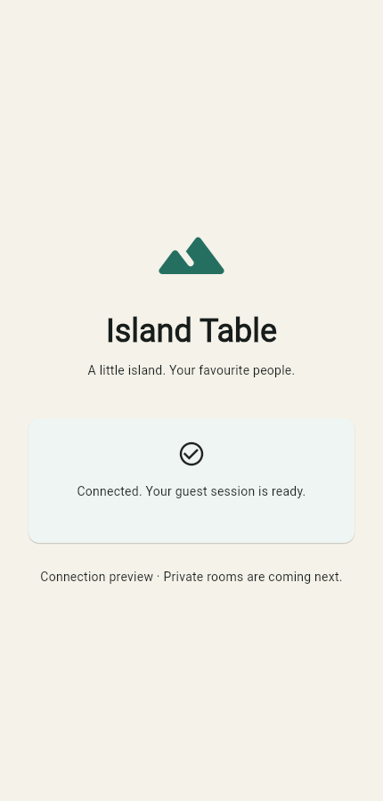

# Phase 1 verification — 2026-09-09

Historical checkpoint: the user subsequently approved Phase 2. See [the current Phase 2 report](phase-2-verification.md) for later changes and authorization status.

Scope: **P1.1–P1.10 only**, implemented by one agent. The user approved PLAN.md and its proposed defaults before source creation. No hosted infrastructure, paid resources, store publication, commits or remote pushes were performed.

## Milestone evidence

| Task | Result and evidence |
| --- | --- |
| P1.1 | Pinned English 2020 base rules and PDF checksum in `packages/game-engine/RULES.md`; protocol/state versions 1; Road Building interruption interpretation recorded |
| P1.2 | Inspected local SDKs; pinned Node/Flutter, exact npm/pub dependencies and lockfiles; initialized Git |
| P1.3 | Flutter Web/iOS/Android targets; strict NestJS, engine and protocol workspace packages; successful builds |
| P1.4 | Complete command catalogue, resource bundles, snapshots, delta paths, errors, handshake and refresh schemas; 115 shared fixtures |
| P1.5 | Typed board IDs, public/private/server/clock partitions and durable transition contracts, including pre-roll continuations |
| P1.6 | Fresh local Supabase migration applied; private schema, eight tables, separate owner/runtime roles, RLS, unique/check/FK constraints and migration tracking verified |
| P1.7 | Minimal local Supabase Auth/Postgres/API services; reproducible configuration helper and ignored local secrets/public client configurations |
| P1.8 | Real anonymous Auth, JWT verification, authenticated Socket.IO, input/origin/rate limits, health/readiness and sanitized errors verified |
| P1.9 | Web release and Android debug builds; iOS simulator build; real Flutter integration on iPhone simulator and Android emulator |
| P1.10 | The same 115 positive/negative JSON fixtures pass in Ajv/TypeScript and Dart; bundled schema byte equality verified |

## Checks performed

| Check | Outcome |
| --- | --- |
| `npm run build` | All three TypeScript workspace packages compile with strict checking |
| Node unit/contract suites | **128 passed**: 115 fixtures, complete schema compilation, private projection, transition contracts, JWT negatives and limiter/config tests |
| Local database/gateway suites | **11 passed** against local Supabase and a real NestJS/Socket.IO listener |
| Dart protocol suite | **116 passed**: 115 shared fixtures plus bundled-schema equality |
| Flutter widget test | Passed: unconfigured app cannot begin authentication |
| `flutter analyze` | No issues after formatting/brace fixes |
| Web release build | Passed using the JavaScript target |
| Chrome Web smoke | Passed: guest connects and page reload reuses the persisted identity without another signup |
| iOS integration | Passed on **iPhone 17 Pro simulator, iOS 26.2**: real Auth, server hello, Keychain persistence and token refresh preserve identity |
| Android integration | Passed on **turnpulse_pixel emulator, API 35**: real Auth, server hello, encrypted persistence and token refresh preserve identity |
| API Docker build/smoke | Passed: non-root UID 1000, database readiness and real authenticated Socket.IO; temporary container stopped |
| Dependency audit | Zero reported npm vulnerabilities after pinning the patched Multer 2.3.0 override |
| Repository hygiene | Local secrets/config/build outputs ignored; source whitespace checks clean |
| Future Render Web helper | Shell syntax checked; hosted/Linux SDK-fetch execution deferred |

Database tests check RLS/ownership, runtime DDL/audit restrictions, deferred host creation, one active slot, seat/name collisions, same-room foreign keys and receipt uniqueness. Gateway tests verify anonymous sign-in, missing/forged/version-mismatched authentication, origin enforcement, malformed commands, fail-closed reads, Data API isolation and same-subject token refresh. Production JWKS verification is exercised with locally generated ES256 keys and negative JWT cases; no hosted project was contacted.

The database was created fresh through `supabase start`, so migration validation is not limited to an already-populated schema. Constraint test fixtures are rolled back; local Auth smoke tests leave a few synthetic guests. No room or game is created by the application.

## Toolchain observed

| Component | Version |
| --- | --- |
| Flutter / Dart | 3.38.8 / 3.10.7 |
| Node / npm / TypeScript | 22.20.0 / 10.9.3 / 5.9.3 |
| NestJS / Socket.IO | 11.2.3 / 4.8.3 |
| Dart Socket.IO client | 3.1.6 |
| Riverpod / Supabase Flutter | 3.3.2 / 2.17.2 |
| Supabase CLI / local PostgreSQL | 2.117.0 / 17.6 |
| Xcode | 26.2 (17C52) |
| JDK / Android emulator | OpenJDK 17.0.17 / 36.3.10 |
| Docker Desktop / Engine | 4.88.1 / 29.7.2 |

## Limits and remaining work

- **Phase 1 exit gate is met for the available local targets.** No blocking credential or tool setup remains for local development.
- Physical Android/iPhone tests, iOS device signing, signed Android release distribution, Safari and switching mobile networks are not verified. Native integration used simulators/emulators.
- Room membership, invitations, profile/nickname validation and room mutations belong to Phase 2. The current UI intentionally offers only guest connection.
- Game rules, full projection/delta processing, command idempotency transactions, clocks, runtime fencing, outbox dispatch and multiplayer recovery remain in their later phases. Having tables/contracts is not evidence those features work.
- The Web build reports a Socket.IO dependency WebAssembly dry-run incompatibility and a Cupertino font-family warning from the Flutter framework. The supported JavaScript Web build succeeds and the connection screen renders correctly. WebAssembly is not a Phase 1 target.
- The Codex in-app browser failed before initialization due to a tool integration error. A local headless Google Chrome smoke test provided Web verification instead.
- Render configuration is prepared but **not deployed or validated by Render's service**. Its SDK helper pins the official Flutter Git tag to the exact commit because the release-manifest URL was unavailable during setup. Hosted TLS/JWKS, free-plan behavior and the Linux Flutter download/build must be verified during deployment work.
- The local Docker smoke uses the production image with development-mode local Auth configuration. It does not claim a hosted TLS test.
- The final local native artifacts use the normal application entry point; integration-test artifacts are not intended for distribution. See README commands to rebuild and run.

## Preview

Next action: user review. **Do not begin Phase 2 until the user authorizes it.**
