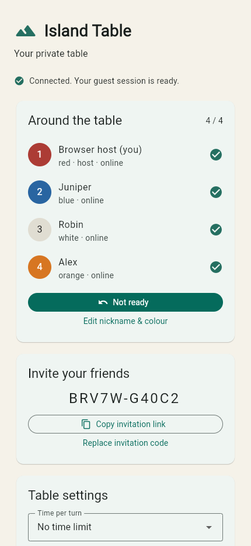

# Phase 2 verification — 2026-09-09

Scope: nickname entry and private lobbies, using one agent and local services only. The user
approved continuation after Phase 1 and requested incorporation of
[Claude's independent review](review-2026-09-09-claude.md). No hosted deployment, commits or pushes
were performed by this implementation agent. Existing Git history and the review file are preserved.

## Milestone evidence

| Task | Evidence |
| --- | --- |
| P2.1 | Nickname form, anonymous Auth/session restoration, no account form |
| P2.2 | Runtime fencing, per-actor command advisory locks, canonical request hashes, durable final receipts and transaction savepoints |
| P2.3 | 50-bit invitations, hash-only room storage, human normalization, collision retry, expiry, rotation and identity/address limits |
| P2.4 | Room-locked seat/colour allocation, NFKC/grapheme nickname policy, unique active memberships |
| P2.5 | Profile editing, readiness, host settings, ten-second host transfer, voluntary leave/rejoin with the original player ID |
| P2.6 | Owner-only membership notification, public snapshots, authenticated presence and first-launch invitation preservation |
| P2.7 | Server and UI require 3–4 connected, ready members; relevant lobby changes reset readiness |
| P2.8 | **Partial:** duplicate create/join and fourth/fifth join races verified. The actual join/game-start race remains untested because no game initializer exists yet |
| P2.9 | Idle expiry at boot/request time, terminal last-player closure and atomic single ongoing slot |
| P2.10 | Same-identity seat restoration on browser reload and server replacement; foreign subscriptions and identity leakage rejected |
| P2.11 | Operator-only 30-day terminal cleanup, receipt-body compaction, retained tombstones and verified `RECEIPT_EXPIRED` replay |

The Phase 2 start endpoint validates the roster under the room lock, then returns
`GAME_NOT_AVAILABLE` while preserving the lobby. It does **not** create an empty ACTIVE match.
This dependency is deliberately left open on P2.8 and must be completed with Phase 3/5 integration.
No board generation, game-rule handlers, clocks, gameplay deltas or rematch features were added.

## Executed verification

| Check | Result |
| --- | --- |
| Strict TypeScript build | Passed for protocol, engine contracts and server |
| Node unit/contract tests | 143 passed, including 125 cross-language protocol fixtures and proxy-address policy |
| Local database/gateway/lobby tests | 23 passed against local Supabase and real Socket.IO clients |
| Flutter unit/widget tests | 130 passed; includes protocol fixtures, schema equality, invitation parsing and mismatched-ACK recovery |
| Flutter analysis | No issues found in final analysis |
| Flutter Web release build | Passed; supported JavaScript target |
| Chrome multi-client lobby smoke | Passed: five independent sessions, invite onboarding, four-seat cap, readiness/start guard, reload identity reuse and closure |
| Android/iOS normal builds | Passed on final source: Android debug APK and iOS simulator app with normal app entry points |
| Native guest connection | Passed on Android API 35 and iPhone 17 Pro simulator iOS 26.2, including stored identity/token refresh |
| Native create/ready/leave flow | Passed on Android API 35 and iPhone 17 Pro simulator iOS 26.2 |
| Local migration | Phase 2 uses the existing Phase 1 migration; no schema change required; constraints/permissions reverified |
| Hosted infrastructure | Not deployed; Render/TLS/proxy routing and free-tier behavior remain unverified |

The local lifecycle suite covers concurrent duplicate creates/joins, changed-payload ID reuse,
Unicode name collisions, foreign subscriptions, same-identity duplicate tabs, the fourth/fifth join
race, colour collisions, host-only settings, readiness resets, start eligibility, rollback after an
injected outbox failure and retry with the same ID, leave/rejoin, code rotation, ten-second host
transfer, server replacement notification/disconnection, unchanged subscriptions, expiry, and
operator retention. Public-wire assertions exclude all synthetic Auth IDs, access tokens and
invitation plaintext. Test teardown removes its own receipts by actor key, including unscoped
rejections, and does not delete unrelated local data.

## Claude review disposition

| Finding | Resolution |
| --- | --- |
| 1: receipt growth/test residue | Added dry-run/apply operator retention; synthetic actor-key cleanup; tombstone replay test. Compact tombstones intentionally remain indefinitely and still require capacity monitoring |
| 2: stale process sockets | Lost epoch retires the coordinator, emits `server.restarting`, disconnects sockets, fails readiness; client reconnects with the original identity and saved pending intent |
| 3: redundant resubscription | Client supplies its installed revision; unchanged authorized requests emit no snapshot, membership or presence. New sockets always get a snapshot |
| 4: idle 1 Hz maintenance | No periodic lobby work without subscriptions; minute cadence normally, one-second cadence only during host absence; boot/request expiry remains enforced |
| 5: outbox semantics | Complete room snapshot coalescing and delivery-marker transaction behavior documented; ordered game deltas explicitly deferred to Phase 5 |
| 6: mismatched ACK dead-end | Clears sending state, retains pending intent, permits same-ID retry; Dart regression test added |
| 7: proxy address | Explicit bounded `TRUSTED_PROXY_HOPS`, default zero, right-side address selection and spoofing/malformed-header tests; Render verification deferred |
| 8: Web assertions | Replaced temporary inspection script with full five-client assertions, including exact signup count and reload identity reuse; failures return nonzero |
| 9: documentation drift | README, PLAN and this verification report updated; P2.8 remains explicitly partial |
| 10: pause enum drift | PLAN reconciled to the shipped protocol names |
| 11: nickname policy | Semantic normalization, Unicode exclusions and lowercase comparison documented |
| 12: future heartbeat fields | `last_seen_at` is not trusted presence; gameplay heartbeat/clock recovery remains Phase 6 work |
| 13: host fallback | PLAN documents lowest occupied seat fallback on voluntary host departure |
| 14: Web invitation storage | Explicitly documented bearer invitation persistence and clearing policy; game hands remain excluded |
| Smaller items | Direct rate-limit ACK construction; dependency promotion recorded; Node test runner documented; Phase 1 screenshots retained as historical evidence |

## Remaining limits

- Actual game start and a join racing that transition require the later engine and persistence integration.
- Physical phones, Safari, release signing, store distribution, native OS URL launch/cold-install flows,
  mobile-network switching and hosted universal/app links are not verified here.
- Native custom-scheme registration and parsing exist; the Web invitation flow is exercised end to end.
- Render ingress hop count, TLS/JWKS in hosted infrastructure, process-routing behavior and the pinned
  Linux Flutter download/build remain deployment checks. No paid resource was enabled.
- The browser plugin failed before initialization with a tool integration error; local Chrome supplied
  browser verification. Flutter accessibility inputs require keyboard/focus synchronization in tests.
- WebAssembly dry-run and Cupertino font warnings are unchanged from Phase 1. The JavaScript build succeeds.
- Room delivery coalesces full committed snapshots; it does not provide gameplay delta replay.
- Operator retention compacts large receipt bodies and deletes old terminal records. Tombstone counts
  remain unbounded by design, preserving protection against arbitrarily old command retries.

## Preview

Next action: user review. Do not implement Phase 3 without authorization.

## Subsequent Phase 3 review follow-up

Claude's round-2 R1 was addressed during Phase 3: unchanged authorized subscriptions now return requester-only presence while still suppressing redundant membership/snapshots and room broadcasts. The updated 23-check local suite passes. Round-2 R2–R5 dispositions and the retained cross-phase dependencies are recorded in [Phase 3 verification](phase-3-verification.md). The original Phase 2 evidence above describes behavior at that phase's gate.
